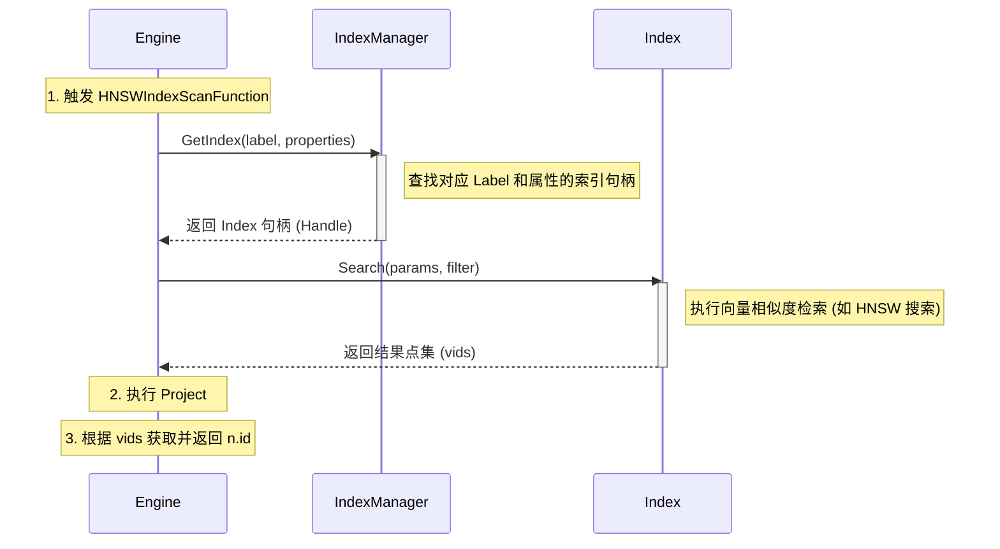
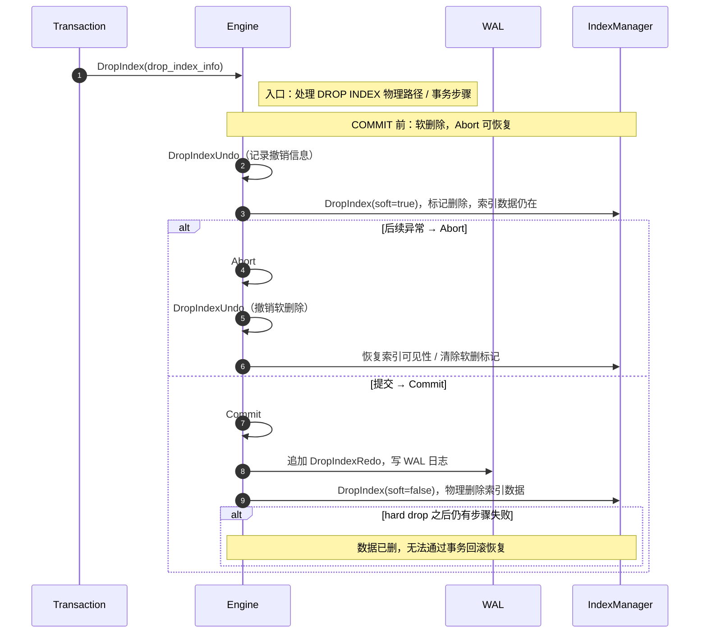
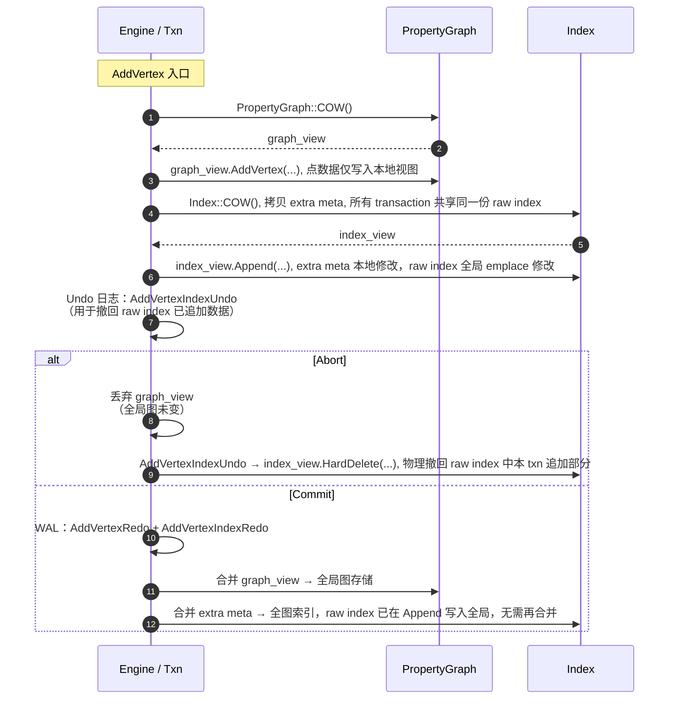

# NeuG 向量支持方案

## 背景：为什么要支持向量？

### 从 AI Agent 到「可检索的知识」

近年的企业级 AI Agent（例如面向内部知识库的 **GBrain** 类助手）通常把「读文档、写答案、给引用」拆成一条可观测的流水线：用户问题先被改写为检索意图，再从文档片段（chunk）集合中召回候选，最后由大模型在候选上生成回答并附上出处。这条流水线的上限，往往不由模型参数单独决定，而由**检索层能否稳定找到“该被看见”的片段**决定。

下面用一个贴近 GBrain 的具体场景说明：为什么单靠一种检索方式不够，以及向量检索（VSS）在其中的位置。

### 场景：售后工程师在 GBrain 里问「这台机器开机蓝屏」

工程师的自然语言问题通常不会与知识库原文逐字一致：手册里可能写的是「启动阶段出现 STOP 代码 0x0000007B」「系统分区驱动配置异常」等术语化表述，而一线同事习惯口语化描述。与此同时，工程师又经常需要**精确命中**某些事实：机型 SKU、BIOS 版本号、补丁 KB 号、内部工单前缀——这些字段一旦错一位，后续操作就可能做错。

因此，一个合理的检索栈会同时用到三类能力（命名与业界常见缩写对齐）：

| 能力 | 缩写 | 作用（在该场景中的分工） |
|------|------|---------------------------|
| 全文 / 关键词检索 | **FTS** | 精确匹配型号、KB 号、错误码、专有名词；可做布尔过滤与短语约束，保证「硬条件」不被语义相似度稀释。 |
| 向量相似度检索 | **VSS** | 在 embedding 空间做「意思相近」的召回：口语问题 ↔ 书面手册、同义改写 ↔ 原文段落，解决字面不一致带来的漏召。 |
| 混合排序 / 重排 | **RNN**（此处指 **Rerank / 神经重排序** 一类混合排序环节，而非循环神经网络本体） | 将 FTS 与 VSS 的多路候选合并、去重、再按相关性重排（常见做法包括倒数排名融合 RRF、学习排序、Cross-encoder 重排等），让「既满足硬约束、又语义最贴近」的片段排在前列，供 Agent 生成与引用。 |

### 如果仅使用精确匹配（只做 FTS）会发生什么？

仅依赖精确匹配时，问题主要不是「答得不够花」，而是**系统性地漏掉正确证据**，从而导致 Agent「看起来在回答、引用却不对」或「直接答不出来」：

1. **词汇鸿沟（lexical mismatch）**：用户说法与文档用词不同，BM25 / 词项匹配无法建立关联。上例中「开机蓝屏」与「STOP 0x7B」没有共同词面，FTS 很容易返回空或无关技术泛文。
2. **召回过于「脆」**：轻微改写、缩写、语序变化、中英文混写，都会让命中集剧烈波动；对企业知识库这种长尾、噪声较多的文本，稳定性差会直接转化为工单解决时间变长。
3. **过度依赖查询构造**：为弥补漏召，产品端往往逼迫用户「学会提问」或堆叠关键词，这与 Agent「自然对话」的产品目标相冲突。
4. **语义近邻无法显式建模**：两段文字意思接近但词交集小，在 FTS 视角下可能完全不相关；而 VSS 正是把「语义近邻」变成可检索的几何近邻。

因此，**支持 VSS 的重要性**在于：它把检索从「找相同词」扩展为「找相近意思」，与 FTS 形成互补——FTS 负责可审计、可解释的硬匹配，VSS 负责覆盖自然语言的表达多样性；再在混合排序阶段把多路信号融合成 Agent 可用的短列表。NeuG 引入向量类型与近似最近邻索引，是为了让图数据库在承载关系与属性的同时，也能在这一类 Agent 检索栈中承担一致的存储与事务语义，而不是把向量数据再次甩给外部碎片化的专用库。

## 需求

我们希望在 NeuG 中引入向量支持能力，具体包括：

- 支持基本的向量数据类型，FP32/FP64 等
- 支持向量数据的批量导入与增量更新
- 支持向量上的距离与相似度运算：L2、cosine 等
- 支持由 HNSW 等结构加速的 KNN/TopK 检索

## 方案

 

框架设计：
- Compiler
    - parser: 提供 create_index/drop_index/... 语法解析
    - optimizer: 提供索引优化，基于索引 cost 估计选择最优的 IndexScan
- Engine 
    - AP: 在 AP 模式下支持 create_index/drop_index bulk 操作
    - TP: 在 TP 模式下支持 insert/update/delete 时更新索引数据
- Storage
    - PropertyGraph & IndexManager 都遵循 ACID
    - PropertyGraph (存储向量数据)
    - IndexManager (存储向量索引)
- ZVec Extension
    - 提供距离函数：vec_distance_l2, vec_distance_cosine, vec_slice，将这些函数注册进 FunctionManager
    - 提供 HNSWIndex, IVFIndex 具体实现，将索引实现注册进 IndexManager


## Cypher API

### Schema 操作

**创建点类型 (包含向量属性)**
```cypher
// FP32、dim=4 的定长数组作为向量列；主键与向量维度在 DDL 中一次声明
CREATE NODE TABLE vector_node (id INT64, vec FLOAT[4], PRIMARY KEY (id));
```

NeuG 通过 Array (定长数组) 支持向量属性类型，具体包括：

| Vector Types (ZVec 侧) | NeuG Types | 说明 |
|--------------------------|------------|------|
| `VECTOR(FP64, dim)` | `ARRAY(DOUBLE, dim)` | 双精度浮点数 |
| `VECTOR(FP32, dim)` | `ARRAY(FLOAT, dim)` | 单精度浮点数 |

我们目前仅支持 Dense Vector，Sparse Vector 暂时不支持。对于向量 `[0.1, 0, 0, 0.4]`，我们仅支持 `[0.1, 0, 0, 0.4]` Dense 表示，而不支持 `{0: 0.1, 3: 0.4}` Sparse 表示。

**删除点类型**
```cypher
// 级联：该类型上的属性、依赖的 HNSW 等需按产品语义一并清理
DROP TABLE vector_node;
```

**修改点类型**

```cypher
// 新增向量列
ALTER TABLE vector_node ADD IF NOT EXISTS vec FLOAT[4];
```

```cypher
// 删列时需要 DROP 依赖该列的向量索引
ALTER TABLE vector_node DROP IF EXISTS vec;
```

### Index 操作

**创建属性索引**

```cypher
// 创建 vec 属性 HNSW 索引，label = 'vector_node'
CREATE INDEX vec_hnsw_index
ON vector_node
USING HNSW (vec)
WITH (metric = 'cosine');
```

**删除属性索引**
```cypher
DROP INDEX vec_hnsw_index IF EXISTS;
```

**查询属性索引**
```cypher
// 查询所有索引信息
CALL SHOW_INDEXES();
```

### 查询操作

**Vector Function**

我们通过 `vec_distance` 族函数与辅助函数来支持向量相关运算，具体包括：

| 名称 | 描述 | 例子 |
|------|------|------|
| `vec_distance_l2(a, b)` | L2（欧氏）距离：各维差方和再开方 | `vec_distance_l2(n.vec, q)` |
| `vec_distance_cosine(a, b)` | 余弦距离 | `vec_distance_cosine(n.vec, q)` |
| `vec_slice(v, start, end)` | 对向量做切片视图（或拷贝），供子空间查询/降维前处理 | `vec_slice(n.vec, 0, 2)` |

```cypher
// 全表逐行算距离，未走 HNSW；适合验证或极小数据量
MATCH (n:vector_node)
RETURN vec_distance_l2(n.vec, [0.1, 0.2, 0.3, 0.4]) AS d;
```

**KNN**

我们采用类似 Postgres or DuckDB 嵌入式语法来支持索引查询，优化器需要根据已创建索引识别出下面查询可以转化为 HNSWIndexScan。

```cypher
// 若存在 HNSW 索引，优化器可将查询改写为 HNSWIndexScan
MATCH (n:vector_node)
ORDER BY vec_distance_l2(n.vec, [0.1, 0.2, 0.3, 0.4])
LIMIT 3;
```

### 写入操作

**数据导入**

vec.csv:
```
id|vec
1|[0.1, 0.2, 0.3, 0.4]
2|[0.2, 0.1, 0.1, 0.1]
...
```

```cypher
CREATE NODE TABLE vector_node (id INT64, vec FLOAT[4], PRIMARY KEY (id));

// CSV 数据导入需要支持 array 类型
COPY vector_node FROM 'vec.csv';
```

vec.json:
```json
[
  { "id": 1, "vec": [0.1, 0.2, 0.3, 0.4] },
  { "id": 2, "vec": [0.2, 0.1, 0.1, 0.1] }
]
```

```cypher
COPY vector_node FROM 'vec.json';
```

```cypher
// vec 数据以 BLOB 形式存储在 parquet 数据文件中，
// 需要支持 parquet array -> arrow array -> NeuG array
COPY vector_node FROM 'vec.parquet';
```

**插入数据**

```cypher
// 插入 id, vec 属性数据
// 插入 vec 索引数据
CREATE (n:vector_node {id: 3, vec: [0.2, 0.2, 0.1, 0.1]});
```

**删除数据**
```cypher
// 删除 id, vec 属性数据
// 删除 vec 索引数据
MATCH (n:vector_node)
WHERE n.id = 1
DELETE n;
```

**更新数据**
```cypher
// 更新 vec 属性数据 (emplace 修改)
// 更新 vec 索引数据 (先删除+新增)
MATCH (n:vector_node)
WHERE n.id = 1
SET n.vec = [0.2, 0.2, 0.1, 0.1];
```

## 调用流程

### KNN 查询

```cypher
MATCH (n:vector_node)
Return n.id
ORDER BY vec_distance_l2(n.vec, [0.1, 0.2, 0.3, 0.4])
LIMIT 3;
```

#### Compiler 阶段


执行流程：
- ApplyRule: 执行 HNSWIndexRule，生成 LogicalPlan
- Estimate Cost: 为生成的 LogicalPlan 估计代价
- Optimizer: 基于 cost 选择最佳执行计划，当某个向量属性有多个 indexing (hnsw, ivf) 时，也是基于代价选择最佳索引查询
- Physical Plan: 将 LogicalPlan 转化为 PhysicalPlan

**LogicalPlan**

```
HNSWIndexScan(label='vector_node', vec=[0.1,...,0.4], topk=3...)
Project(n.id)
```

**PhysicalPlan**

为了让不同的 IndexScan 复用统一的 Physical PB 表示，我们将不同的 IndexScan 统一表示为 ProcedureCall，ProcedureCall 内部调用不同的 ScanFunction。

Physical Plan:
```json
{
  "plan_id": 0,
  "plan": [
    {
      "opr": {
        "procedure_call": {
          "query": {
            "query_name": {
              "name": "HNSW_INDEX_SCAN()"
            },
            "arguments": [
              {
                "param_name": "label",
                "param_ind": 0,
                "const": {
                  "str": "vector_node"
                }
              },
              {
                "param_name": "property",
                "param_ind": 1,
                "const": {
                  "str": "vec"
                }
              },
              {
                "param_name": "value",
                "param_ind": 2,
                "const": {
                  "f64_array": {
                    "item": [0.1, 0.2, 0.3, 0.4]
                  }
                }
              },
              {
                "param_name": "top_k",
                "param_ind": 3,
                "const": {
                  "i64": 3
                }
              },
              {
                "param_name": "metric",
                "param_ind": 4,
                "const": {
                  "str": "L2"
                }
              }
            ]
          }
        }
      },
      "meta_data": [
        {
          "type": {
            "graph_type": {
              "element_opt": "VERTEX",
              "graph_data_type": [
                {
                  "label": {
                    "label": 0
                  },
                  "props": []
                }
              ]
            }
          },
          "alias": 0
        }
      ]
    },
    {
      "opr": {
        "project": {
          "mappings": [
            {
              "expr": {
                "operators": [
                  {
                    "var": {
                      "tag": {
                        "id": 0
                      },
                      "property": {
                        "key": {
                          "name": "id"
                        }
                      },
                      "node_type": {
                        "data_type": {
                          "primitive_type": "DT_SIGNED_INT64"
                        }
                      }
                    },
                    "node_type": {
                      "data_type": {
                        "primitive_type": "DT_SIGNED_INT64"
                      }
                    }
                  }
                ]
              },
              "alias": 1
            }
          ],
          "is_append": false
        }
      },
      "meta_data": [
        {
          "type": {
            "data_type": {
              "primitive_type": "DT_SIGNED_INT64"
            }
          },
          "alias": 1
        }
      ]
    },
    {
      "opr": {
        "sink": {
          "tags": []
        }
      },
      "meta_data": []
    }
  ],
  "flag": {
    "read": true,
    "insert": false,
    "update": false,
    "schema": false,
    "batch": false,
    "create_temp_table": false,
    "checkpoint": false,
    "procedure_call": true
  }
}
```

#### Engine 阶段



执行流程：
- 调用 `HNSWIndexScanFunction`
- 调用 `IndexManager::GetIndex(label, properties)`，获取 Index 句柄
- 调用 `Index::Search(params, filter)`，获取结果点集 vids
- 执行 `Project`，获取 vids 属性作为结果返回

### Create Index

目前仅在 AP 场景下支持 Create Index，在 Create Index 后，建议用户通过显示 `Checkpoint` 保存当前建好的索引数据。中间索引数据写坏不保证回滚，会存在部分数据成功，部分数据失败的问题。

```python
conn.execute("""
    CREATE INDEX vec_hnsw_index
    ON vector_node
    USING HNSW (vec)
    WITH (metric = 'cosine');
""")
conn.execute("Checkpoint")
```

**Cypher 查询**

```cypher
CREATE INDEX vec_hnsw_index
ON vector_node
USING HNSW (vec)
WITH (metric = 'cosine');
```

**Compiler**

Protobuf:
```
message CreateIndex {
    // Unique index name.
    string name = 1;
    IndexMeta meta = 2;
    // WITH clause: implementation-specific options (metric, ef_search, ...).
    map<string, common.Value> options = 3;
    ConflictAction conflict_action = 4;
}
```

**Engine**

- 调用 `IndexManager::GetAllIndexes()`，检查 index_name 唯一性，如果已存在报错，否则继续执行
- 调用 `IndexManager::CreateIndex(name, meta, options)`，创建索引


### Drop Index

Schema 相关的删除操作会经过两个阶段：
- `Soft Delete`：在 COMMIT 以前先软删除，也就是标记删除，但并不真正删除数据，这样可以保证当前 transaction 中的其它操作可以看见当前删除操作，同时也避免 Abort 时无法恢复数据的问题，Abort 真正恢复的是这些 SoftDelete 操作
- `Hard Delete`：在 Commit 时才真正删除数据，但如果 Commit 中间发生异常，已经删除的数据是无法再恢复的

**Cypher 查询**

```cypher
DROP Index vec_hnsw_index IF EXISTS;
```

#### Compiler 阶段

Protobuf:
```
message DropIndex {
    string name = 1;
    ConflictAction conflict_action = 2;
}
```

#### Engine 阶段



执行流程：
- 调用 `DropIndex`
- `DropIndexUndo`：先记录 `DropIndexUndo` 操作，Abort 时可以撤销软删除
- `IndexManager::DropIndex(soft=true)`：标记删除，不真正删除索引数据
- `Abort`：出现异常后，执行 `DropIndexUndo`，撤销索引软删除
- `Commit`：
    - 写 WAL 日志，记录 `DropIndexRedo` 操作
    - `IndexManager::DropIndex(soft=false)`：hard 删除索引数据，中间任意操作失败都无法回
    滚，因为数据已经被删除，无法恢复

### 插入/删除/更新数据

#### 待讨论

##### 讨论一：带索引的写是 update or insert transaction ？

```cypher
// 插入向量和索引数据
Create (n:vector_node {id: 1, vec: [0.1, 0.1, 0.2, 0.2]});
```

目前方案认为带索引的写不再是 insert_transaction，而是 update_transaction，主要有以下几点原因：
- **高并发性能**：insert_transaction 设计的主要目前是为了在保证一致性的前提下尽可能提升查询的并发，整个链路设计上偏向轻量锁或者无锁结构，索引的插入操作需要保证线程安全且可能比较重，例如 HNSW 索引需要计算新增点与其他点的距离并维护多层的 neighbors 结构，会影响 insert_transaction 高并发性能。
- **IngestWal 设计**：数据首先被写在 transaction 本地状态中，在 commit 阶段通过原子的 IngestWal 保证全部成功或者全部失败。索引的批量插入难保证这样的原子性。 

结合以上两点，我们进一步区分 Create 插点操作的 access_mode：
- 插入点数据+无索引 -> insert_transaction
- 插入点数据+有索引 -> update_transaction

##### 讨论二：如何在 update transaction 中支持索引更新操作 ？

NeuG UpdateTransaction 会进行一版重构，主要在于:

| 维度 | Before | After |
|------|--------|-------|
| 并发控制 | 独占，read + update 不可并发 | read + update 可并发 |
| 实现层面 | emplace 修改，通过 undo 操作回滚 | 通过 COW 维护 transaction 内部视图，commit 阶段才真正将更新写入到全局存储中 |

目前索引设计为 Append-Only 结构，仅包含 Search 和 Append 接口：
- Search: 从索引结构中返回所有满足条件（不区分版本）的 vids，通过 MVCC 过滤保证版本隔离
- Append: 按 vid 追加索引数据，可能需要额外的 id mapping，将 vid 映射为索引内部 id，比如在 ZVec HNSW 中，我们维护了 vid <-> doc_id 映射
- Delete: 没有 Delete 接口，为了保证多版本，不会物理删除索引数据，多个版本的索引数据会同时存在于索引结构中，通过 Search 阶段执行 MVCC 过滤保证隔离性
- Update: 没有 Update 接口，实现为 Delete + Append，第二次 Append 操作会为 vid 分配新的 doc_id (递增)，不会复用旧 doc_id，索引结构中会同时存在两个 doc_id 的索引数据，对应于不同版本


```c++
class Index {
public:
    // 创建新索引
    Index(
        const std::string &name, // 索引 unique_name           
        const IndexMeta &meta, // 索引元数据
        case_insensitive_map_t<Value> &options);  // WITH (metric='cosine', ef_search=...)

    // 查询接口
    Status Search(
        const IndexQueryParams &params, // 索引参数，根据不同索引定义不同实现
        const IndexFilter &filter, // 执行 MVCC 和属性过滤
        std::vector<vid_t> &results // 返回点集结果
        );
    
    // 按点插入接口
    Status Append(
        vid_t vid, // 当前新增点
        const std::vector<Property> &values // 当前新增点的属性
    );
    
    // 没有删除接口，不物理删除索引数据，通过 MVCC 保证 Search 查询不到已经删除的点
    // Status Delete(vid_t vid);

    // 没有更新接口，实现为 delete + append
    // Status Update(
    //     vid_t vid, // 更新点
    //     const std::vector<Property> &new_values // 更新点的新属性
    //     );
    
    // 删除整个索引
    Status Drop();

    // 内存索引数据一次性持久化到磁盘
    Status Checkpoint();

    // 清理优化：物理删除索引数据，用于回滚或者 Compact 回收等
    Status HardDelete(const std::vector<vid_t> ids);

protected:
    // 多线程并发保护
    std::mutex lock;
};
```

**是否需要为索引实现 COW?**

我们将索引数据分成两部分来讨论：
- raw index data：底层索引数据，比如 zvec hnsw 索引数据，数据量大
- extra meta data：例如 vid <-> doc_id 这样的映射，轻量数据

raw index data 实现 COW 开销非常大，比如 zvec hnsw 索引的存储开销来自两部分：
- graph_neighbors: 每一个 doc_id 在多层的邻居
- 向量数据：zvec 会将向量数据拷贝到内部缓冲区

结合以上因素，目前提出的方案是：
- raw index data: 不实现 COW，所有 transaction 共享同一个全局索引视图，索引更新是 emplace 发生，立刻追加到全局索引中，通过 MVCC 保证版本隔离
- extra meta: 支持 COW，每一个 transaction 拥有各自本地的 mapping 拷贝，通过 COW 保证 read + update 操作的版本隔离


  

#### 流程图

```cypher
// 插入向量和索引数据
Create (n:vector_node {id: 1, vec: [0.1, 0.1, 0.2, 0.2]});
```





我们以 insert 为例展示 update_transaction 的整个调用流程：
- 调用 `AddVertex`
- 调用 `graph_view = PropertyGraph::COW()`，得到 transaction 本地 graph 视图
- 执行 `graph_view.AddVertex(...)`，将点数据写入到本地视图
- 调用 `index_view = Index::COW()`，得到 transaction 本地 index 视图
- 调用 `index_view.Append(..)`，更新本地拷贝 Extra Meta 数据，更新全局共享 raw index 数据
- 在 Undo 日志中记录 `AddVertexIndexUndo`，用于物理撤销在 raw index 中追加的数据
- Abort 异常发生：
    - 直接丢弃 graph_view 修改，因为全局图存储数据并未发生更新
    - 执行 `AddVertexIndexUndo`，调用 index_view.HardDelete(...) 操作将当前在 raw index 中已追加数据物理撤回
- Commit：
    - 在 WAL 中记录 `AddVertexRedo` 和 `AddVertexIndexRedo`
    - 将 graph_view 修改合并到全局图存储中
    - 将 extra meta 修改合并到全图索引中，不需要合并 raw index 数据


## 索引接口

### Index Interface

```c++
class Index {
public:
    // 创建新索引
    Index(
        const std::string &name, // 索引 unique_name           
        const IndexMeta &meta, // 索引元数据
        case_insensitive_map_t<Value> &options);  // WITH (metric='cosine', ef_search=...)

    // 查询接口
    Status Search(
        const IndexQueryParams &params, // 索引参数，根据不同索引定义不同实现
        const IndexFilter &filter, // 执行 MVCC 和属性过滤
        std::vector<vid_t> &results // 返回点集结果
        );
    
    // 按点插入接口
    Status Append(
        vid_t vid, // 当前新增点
        const std::vector<Property> &values // 当前新增点的属性
    );
    
    // 没有删除接口，不物理删除索引数据，通过 MVCC 保证 Search 查询不到已经删除的点
    // Status Delete(vid_t vid);

    // 没有更新接口，实现为 delete + append
    // Status Update(
    //     vid_t vid, // 更新点
    //     const std::vector<Property> &new_values // 更新点的新属性
    //     );
    
    // 删除整个索引
    Status Drop();

    // 内存索引数据一次性持久化到磁盘
    Status Checkpoint();

    // 清理优化：物理删除索引数据，用于回滚或者 Compact 回收等
    Status HardDelete(const std::vector<vid_t> ids);

protected:
    // 多线程并发保护
    std::mutex lock;
};
```

**Index Meta: 维护索引元数据**

```c++
struct IndexMeta {
    // 索引 unique_name，例如 'vec_hnsw_index'
    std::string name;
    // 索引类型名称，例如 'HNSW'
    std::string type;
    // 索引绑定的 label, properties 信息
    // 可以支持 vertex or triplet edge type
    IndexBindSchema schema;
};

struct IndexBindSchema {
    LabelEntry label;
    // 一个索引可能绑定多个属性，虽然目前 NeuG 支持的只有一列属性
    std::vector<int> property_ids;
    std::vector<std::string> property_names;
    std::vector<DataType> property_types;
}

// denote a vertex or triplet edge type
struct LabelEntry {
    ...
};
```

**Index Filter: 用于在索引查询中执行 MVCC 和属性过滤**

```c++
class IndexFilter {
    IndexFilter(
        const IStorageInterface &transaction, // transaction context
        const common::Expression &filter_expr // filtering condition based on scalar properties
    )
    
    // filter the vertex based on MVCC
    bool MVCCFilter(vid_t v) {
        // StorageReadInterface::GetVertexSet() 获取当前版本可见的点集，
        // 利用该点集过滤 v
    }

    // filter the vertex based on filter expression
    bool PropertyFilter(vid_t v) {
        // 通过 transaction 获取当前点的属性值，并执行 Expression::Eval 计算
    }
};
```

### Index Manager

```c++
// 统一管理所有 Index
class IndexManager {
public:
    Status CreateIndex(
        const std::string &name,
        const IndexMeta &meta,
        case_insensitive_map_t<Value> &options);
    
    Status DropIndex(
        const std::string &name,
        bool is_soft // 标记删除，保证 update_transaction 中的其他操作可见，但不物理删除数据，防止需要回滚
    );

    Status GetIndex(
        const LabelEntry &label,
        const std::vector<std::string> property_names,
        std::vector<Index*> &target_index // 返回特定属性列的所有索引
    );

    Status GetAllIndexes(
        std::vector<Index*> &target_index // 返回所有索引
    )

private:
    std::vector<std::unique_ptr<Index>> indexes;
};
```

### ZVec HNSW Index

ZVecHNSWIndex 包含三个重要的内部对象：
- IndexBridge: ZVec 原生的 Index 接口
- HNSWDocIdMap: 维护 vid <-> doc_id 的双向映射，一对一
- index_path: 持久化文件地址

```c++
class HNSWIndex {
private:
    IndexBridge zvec_index;
    HNSWDocIdMap vertex_doc_map;
    std::string index_path;
}
```

#### IndexBridge

```c++
class IndexBridge {
 public:
  using Pointer = std::shared_ptr<IndexBridge>;

  ~IndexBridge();

  // Non-copyable
  IndexBridge(const IndexBridge&) = delete;
  IndexBridge& operator=(const IndexBridge&) = delete;

  // Movable
  IndexBridge(IndexBridge&&) noexcept;
  IndexBridge& operator=(IndexBridge&&) noexcept;

  /**
   * @brief Create a new IndexBridge for batch index building.
   * @param target_param Parameters for the target index (e.g., HNSW, IVF).
   *                     Vectors will be collected first, then batch-built.
   * @return Pointer to the bridge, or nullptr on failure.
   */
  static Pointer Create(const BaseIndexParam& target_param);

  /**
   * @brief Deserialize a previously serialized index.
   * @param param_json JSON string of index parameters.
   * @param data Serialized index data.
   * @param size Size of the serialized data.
   * @return Pointer to the bridge, or nullptr on failure.
   */
  static Pointer Deserialize(const std::string& param_json, const void* data,
                             size_t size);

  // ========== Write Operations (Collection Phase) ==========

  /**
   * @brief Add a vector to the collection (O(1) operation).
   * @param doc_id Document ID for this vector.
   * @param vector Pointer to the vector data.
   * @param dimension Dimension of the vector.
   * @return 0 on success, non-zero on error.
   */
  int Add(uint32_t doc_id, const float* vector, uint32_t dimension);

  /**
   * @brief Build the target index from collected vectors.
   *
   * This performs batch index construction using Merge, which is much faster
   * than adding vectors one by one to HNSW.
   *
   * @param concurrency Number of threads for building (0 = use default).
   * @return 0 on success, non-zero on error.
   */
  int Build(int concurrency = 0);

  // ========== Query Operations ==========

  /**
   * @brief Search the index for nearest neighbors.
   * @note Must call Build() before searching.
   */
  int Search(const float* query, uint32_t dimension, uint32_t topk,
             const BaseIndexQueryParam* query_param,
             std::vector<BridgeSearchResultItem>* results);

  // ========== Serialization ==========

  /**
   * @brief Serialize the built index to a string.
   * @note Must call Build() before serializing.
   */
  int Serialize(std::string* output);

  /**
   * @brief Get the index parameters as JSON string.
   */
  std::string GetParamJson() const;

  // ========== Metadata ==========

  uint32_t DocCount() const;
  IndexType GetIndexType() const;
  MetricType GetMetricType() const;
  uint32_t GetDimension() const;
  bool IsBuilt() const;

  // ========== Index Maintenance ==========

  int Flush();

 private:
  IndexBridge();

  struct Impl;
  std::unique_ptr<Impl> impl_;
};
```

#### HNSWDocIdMap

HNSWDocIdMap 维护 vid <-> doc_id 的一对一映射关系，为什么需要额外维护该映射而不是直接将 vid 作为 doc_id 呢？

考虑更新操作：
```cypher
MATCH (n:vector_node)
WHERE n.id = 1
SET n.vec = [0.1, 0.1, 0.1, 0.1]
```

NeuG 直接通过覆写来实现属性的更新操作，并不是 Append-Only 方式（delete + insert），更新后的点 vid_t 不变，vid_t 槽位对应的属性数据发生修改。但 ZVecIndex 的设计原则是 Append-Only，对索引数据的更新只能是 delete + insert，这意味着对同一个 vid 前后两次的 doc_id 不一致，新的insert 操作会导致 vid 和 doc_id 不一致，需要用额外 mapping 来维护映射关系。

#### 索引实现

```c++
class HNSWIndex {
public:
    HNSWIndex(
        const std::string &name,
        const IndexMeta &meta,
        case_insensitive_map_t<Value> &options,
        const std::string &path
    ) {
        // 以内存方式打开索引数据文件
        zvec_params.storage_options = kMemory;
        // 或者以 MMAP 方式打开索引数据文件，但开启 copy_on_write 机制，
        // 需要通过显示 flush/close 才能将更新数据写回到磁盘
        zvec_params.storage_options = kMMAP;
        zvec_params.copy_on_write = true;
        // 构建 IndexBridge
        zvec_index = IndexBridge::Create(zvec_params);
    }

    Status Search(
        const HNSWIndexParams &params, // 索引参数，根据不同索引定义不同实现
        const IndexFilter &filter, // 执行 MVCC 和属性过滤
        std::vector<vid_t> &results // 返回点集结果
        ) {
        // 从 params 获取：target query, dim, top
        // 基于 filter 构建 ZVec::IndexFilter，传入 query_param
        zvec_index->Search(query, dimension, topk, query_param, doc_results);
        // 将 doc_ids 映射成 vid_t 返回
    }

    // 按点插入接口
    Status Append(
        vid_t vid, // 当前新增点
        const std::vector<Property> &values // 当前新增点的属性
    ) {
        // 分配递增 doc_id，并更新 vector_doc_map
        uint32_t doc_id = allocate_doc_id(vid);
        // 从 Property 中获取 value pointer
        const void *vec = get_value_pointer(values[0]);
        zvec_index->Add(doc_id, vec);
    }
    
    Status Drop() {
        // 删除索引文件 index_path
    }

    Status Checkpoint() {
        // Close or Flush 操作将内存索引数据写回到磁盘
        zec_index.Close();
    }

    Status HardDelete(const std::vector<vid_t> vids) {
        // 待调研：ZVec 如何支持物理删除索引数据
    }
protected:
    IndexBridge zvec_index;
    std::string index_path;
    HNSWDocIdMap vertex_doc_map;
};
```