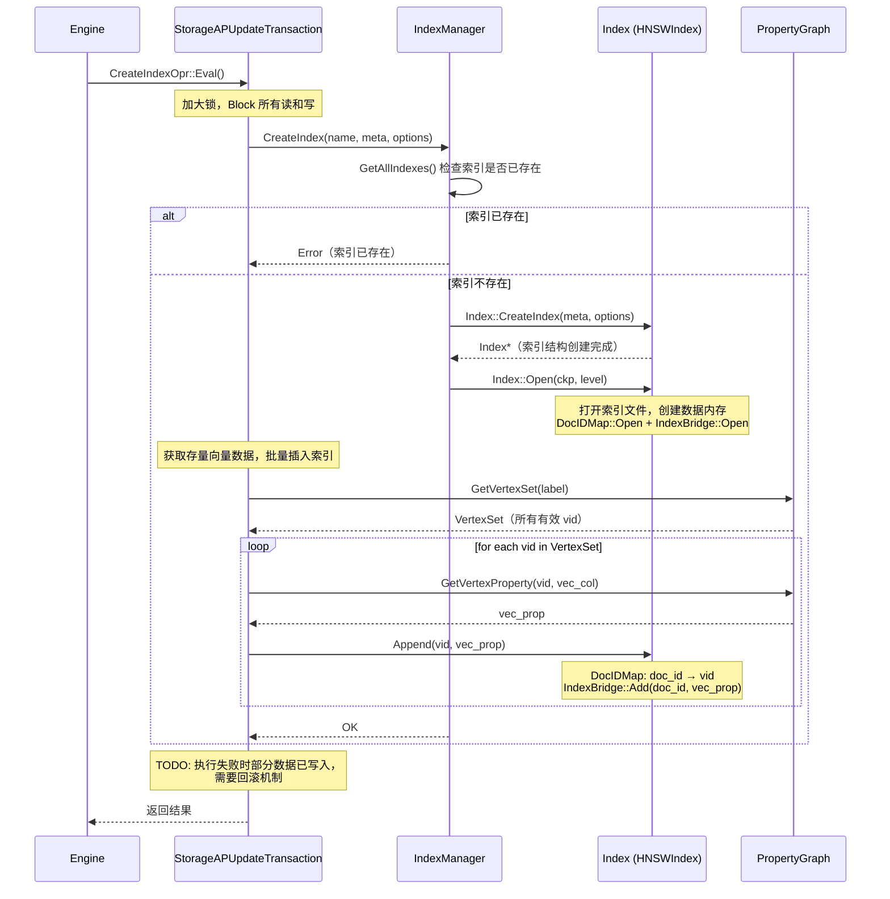

# Create Index 功能实现

## 定义索引功能接口

参考 overall-design.md 中的相关内容，帮我定义 Index & IndexManager Interface，只要包括功能接口：Open/Dump/Search/Append，先不用包括 COW 需要的 fork/lazyfork 接口，这个会放到后续阶段实现。

## 实现 HNSW

在 extension 模块中引入 ZVec，通过 BUILD_EXTENSIONS=zvec 启用

启动 BUILD_EXTENSIONS=zvec 后的编译过程：
- 通过 git clone 将 zvec 源码下载到 third_party 本地
- 配置 zvec third_party cmake，看是否可以只 enable zvec index 相关模块，其他模块关闭
- 在 extension 层实现 HNSWIndex，利用 zvec Index or IndexBridge 接口，先实现 Open/Dump/Append 功能

## 端到端实现 Create Index 功能

### Compiler 

支持 Antlr 语法：
```
CREATE INDEX vec_hnsw_index
ON vector_node
USING HNSW (vec)
WITH (metric = 'cosine');
```

经过 parser -> planner -> optimizer -> convertor，生成 CreateIndexOpr Plan:
```
message CreateIndexOpr {
    // Unique index name.
    string name = 1;
    IndexMeta meta = 2;
    // WITH clause: implementation-specific options (metric, ef_search, ...).
    map<string, common.Value> options = 3;
    ConflictAction conflict_action = 4;
}
```

支持从语法 -> physical plan 的完整链路，这部分工作量比较大，切换子任务执行，主任务构造好单元测试，让子任务持续迭代 

#### 单元测试

在 tests/compiler 模块下增加 compiler 的单元测试，参考 pattern_test.cpp，验证 Create Index 查询是否可以生成最终 physical plan

### Engine

实现 CreateIndexOpr
- 先支持打开空图+CreateIndex (没有数据导入)，按照 overall-design.md 中流程图实现，调用 Index::Constructor, Index::Open
- 再支持 Copy FROM + Create Index，对于存量数据调用 Append 将索引数据插入

## 测试

生成端到端测试。创建 tools/python_bind/test_hnsw_index.py

具体测试的功能包括：
- 打开空图 + Create HNSW Index 
- COPY FROM + Create HNSW Index
- Create 单点插入 + Create HNSW Index

运行并修复，直到所有测试通过。

## 可行性评估

基于对 codebase 的深入分析，以下是对本方案的可行性评估。

### 整体判断：方案可行，但有若干需要注意的问题

### 1. Extension 集成 ZVec — 可行

**现有基础设施良好：**
- `extension/` 目录已有 `parquet` 和 `httpfs` 两个成熟的 extension 模板
- `extension/CMakeLists.txt` 提供了 `add_extension_if_enabled()` 函数，只需新增 `add_extension_if_enabled("zvec")` 即可
- `ExtensionAPI` 已支持 `registerFunction()`，可以注册 `vec_distance_l2`、`vec_distance_cosine` 等函数
- Extension 动态库加载机制 (`ExtensionLibLoader`) 已经完善

**ZVec 可用性确认（已验证）：**
- ZVec 源码位于 `/Users/zhouxiaoli/Downloads/zvec/`，已成功构建
- 使用自定义 cmake (bazel.cmake 宏: `cc_library`, `cc_directory`)，C++17 标准
- 已编译产出关键静态库：`libzvec_core.a`, `libcore_interface.a`, `libcore_knn_hnsw.a`, `libcore_metric.a` 等
- 核心接口头文件路径：`src/include/zvec/core/interface/index.h`
- NeuG 所需的关键 API 完全可用：
  - `IndexFactory::CreateAndInitIndex(param)` — 创建索引
  - `Index::Open(file_path, storage_options)` — 打开已有索引
  - `Index::Add(vector, doc_id)` — 追加数据
  - `Index::Search(query, param, result)` — 搜索
  - `Index::Flush()` — 持久化
  - `Index::Close()` — 关闭
  - `IndexFilter` — 支持 `std::function<bool(uint64_t key)>` 回调，可直接适配 NeuG 的 MVCC 过滤
- `HNSWIndexParam` 支持: `metric_type`(L2/Cosine/IP), `dimension`, `m`, `ef_construction`
- `HNSWQueryParam` 支持: `topk`, `ef_search`, `filter`
- 集成方式：将 zvec 源码放入 `third_party/zvec`，通过 `add_subdirectory` 或直接链接预编译 `.a` 文件

**潜在问题：**
- **ZVec 使用自定义 cmake 宏**（bazel.cmake 中的 `cc_library`/`cc_directory`），直接 `add_subdirectory` 可能与 NeuG 的 cmake 环境冲突。建议方案：仅引入 zvec 预编译的 `.a` 静态库 + 头文件，不编译源码
- **ExtensionAPI 缺少 `registerIndex()` 接口** — 当前只支持注册 Function 和 FileSystem，需要新增 Index 注册机制
- **C++ 标准差异**：ZVec 是 C++17，NeuG 是 C++20，向后兼容无问题

### 2. Compiler 链路（Parser → Planner → Converter） — 工作量最大，有风险

**需要新增的内容：**

| 层 | 现状 | 需要做的 |
|---|---|---|
| **ANTLR Grammar** | 无 `CREATE INDEX` 语法 | 新增 `nEUG_CreateIndex` 规则到 `Cypher.g4` |
| **LogicalOperator** | 无 `CREATE_INDEX` 枚举 | 新增 `LogicalOperatorType::CREATE_INDEX` + `LogicalCreateIndex` 类 |
| **Binder** | 无 index binding | 新增 `BoundCreateIndexInfo` |
| **GDDLConverter** | 不含 index 转换 | 新增 `convertCreateIndex()` |
| **Proto (Physical)** | `PhysicalOpr.Operator.oneof` 无 index 操作 | 新增 `CreateIndexOpr` message + 新增 field 编号（如 63） |
| **PlanParser/OprBuilder** | 无 | 新增 `CreateIndexOprBuilder` |

**潜在问题：**
- **ANTLR 代码生成**：修改 `.g4` 文件后需要重新生成 C++ parser 代码（项目有 `AUTO_UPDATE_GRAMMAR` option），这个链路是否稳定需要验证
- **IndexCatalogEntry 已存在** — `include/neug/compiler/catalog/catalog_entry/index_catalog_entry.h` 已有 `IndexCatalogEntry`，说明 catalog 层已预留了索引支持。这是好消息，但也意味着需要与现有的 `createIndex`/`dropIndex` catalog API 对齐
- **Converter 编号冲突**：`PhysicalOpr.Operator.oneof` 当前最大编号到 74 (ext_uninstall)，新增 index 操作需选择合适的空闲编号

### 3. Engine (CreateIndexOprBuilder 执行) — 可行但有设计细节

**现有模式清晰：**
- 参考 `CreateVertexTypeOprBuilder`，实现 `CreateIndexOprBuilder` 继承 `IOperatorBuilder`
- 通过 `PlanParser::register_operator_builder()` 注册

**潜在问题：**
- **Index 生命周期管理**：spec 中 Index 需要 `Open/Dump` 语义来支持 checkpoint，但当前 `PropertyGraph::Open()` / `Dump()` 流程中没有 IndexManager 的调用点。需要在 `NeugDB` 或 `PropertyGraph` 中新增 IndexManager 并插入 Open/Dump 链路
- **Index 与 PropertyGraph 的耦合**：Create Index 执行时需要访问 `VertexTable` 中的数据来做 Append（存量数据建索引），这依赖于 Transaction 能正确读取属性列

### 4. 存储层 (DocIDMap + IDataContainer) — 可行

**良好基础：**
- `IDataContainer` 接口已定义清楚 (`Open/Resize/Dump/Close`)
- `MMapContainer` 实现已存在 (`include/neug/storages/container/mmap_container.h`)
- `file_names.h` 定义了数据文件管理逻辑

**潜在问题：**
- **Checkpoint 框架**：spec 中描述了 `Module` + `ModuleDescriptor` + `Checkpoint` 的层次，但当前代码中未看到 `Module` 接口的通用定义。现有的 `VertexTable::Open/Dump` 是直接操作文件的，没有统一的 Module 抽象。这意味着要么：
  - (a) 新增 Module 抽象，重构现有代码 — 工作量大
  - (b) Index 直接参考 VertexTable 的 Open/Dump 模式，不引入 Module 抽象 — **推荐第一阶段采用此方式**

### 5. 关键风险点汇总

| 风险 | 严重度 | 说明 |
|---|---|---|
| ~~**ZVec 可用性**~~ | ~~高~~ | ~~已确认可用~~，静态库已编译，API 接口清晰 |
| **ZVec cmake 集成** | 中 | ZVec 使用自定义 bazel.cmake 宏，建议采用预编译 .a + 头文件方式集成，避免 cmake 冲突 |
| **ANTLR 重新生成** | 中 | 修改 .g4 后需重新生成 parser，可能有编译兼容性问题 |
| **无 Module 统一抽象** | 中 | 现有代码无 Module/ModuleDescriptor 层，Index 的 Open/Dump 需要自行管理，不能直接复用 spec 描述的框架 |
| **IndexManager 插入 DB 生命周期** | 中 | 需要侵入 `NeugDB::Open()`、`createCheckpoint()`、`PropertyGraph` 等核心路径 |
| **Compiler 链路长** | 中 | Grammar → Visitor → Binder → LogicalOp → Converter → Proto → OprBuilder，任何一环出问题都需要调试 |

### 6. 建议的实施顺序调整

Spec 的顺序基本合理，但建议：

1. **先确认 ZVec 可用性** — 能否编译出静态库、头文件接口是否稳定
2. **先做 Proto + Engine** — 先硬编码一个 CreateIndexOprBuilder（不经过 parser，直接单元测试调用），验证 Index::Open/Dump/Append 能跑通
3. **再做 Compiler 链路** — 这是最长的一段，独立可测
4. **最后做端到端测试**

这样可以尽早暴露 ZVec 集成问题，避免 Compiler 做完才发现 Engine 层不通。

### 7. ZVec 集成设计方案

#### 7.1 集成方式：预编译静态库 + 头文件

```
third_party/zvec/
├── include/              # 从 zvec/src/include/zvec/ 拷贝
│   └── zvec/
│       ├── core/
│       │   ├── interface/
│       │   │   ├── index.h           # Index, HNSWIndex, FlatIndex
│       │   │   ├── index_factory.h   # IndexFactory
│       │   │   ├── index_param.h     # HNSWIndexParam, HNSWQueryParam, MetricType
│       │   │   └── constants.h
│       │   └── framework/
│       │       ├── index_filter.h    # IndexFilter (std::function<bool(uint64_t)>)
│       │       ├── index_meta.h
│       │       ├── index_storage.h
│       │       └── ...
│       └── ailego/                   # ZVec 内部依赖
├── lib/                  # 预编译产物
│   ├── libzvec_core.a
│   ├── libcore_interface.a
│   ├── libcore_knn_hnsw.a
│   ├── libcore_metric.a
│   ├── libcore_framework.a
│   ├── libzvec_ailego.a
│   └── libcore_utility.a
└── CMakeLists.txt        # 提供 zvec::core imported target
```

#### 7.2 NeuG HNSWIndex 适配层

```c++
// extension/zvec/include/hnsw_index.h
#include <zvec/core/interface/index.h>
#include <zvec/core/interface/index_factory.h>

namespace neug::index {

class HNSWIndex : public IIndex {
public:
    // 创建新索引
    static std::unique_ptr<HNSWIndex> Create(
        const std::string& name,
        const IndexMeta& meta,
        const options_t& options);  // metric, m, ef_construction

    // 从文件打开
    void Open(const std::string& file_path) override;

    // 持久化
    void Dump(const std::string& file_path) override;

    // 追加数据
    void Append(doc_id_t doc_id, const float* vector, int dim) override;

    // 搜索
    std::vector<std::pair<doc_id_t, float>> Search(
        const float* query, int dim, int topk,
        const std::function<bool(uint64_t)>& filter = nullptr) override;

private:
    zvec::core_interface::Index::Pointer zvec_index_;
};

} // namespace neug::index
```

#### 7.3 关键 API 映射

| NeuG 操作 | ZVec API |
|---|---|
| `HNSWIndex::Create(options)` | `IndexFactory::CreateAndInitIndex(HNSWIndexParam{metric, dim, m, ef})` |
| `HNSWIndex::Open(path)` | `index->Open(path, {StorageType::kMMAP, false, false})` |
| `HNSWIndex::Dump(path)` | `index->Flush()` (ZVec 内部管理文件写入) |
| `HNSWIndex::Append(doc_id, vec)` | `index->Add(DenseVector{vec}, doc_id)` |
| `HNSWIndex::Search(query, topk, filter)` | `index->Search(DenseVector{query}, HNSWQueryParam{topk, ef_search, filter}, &result)` |
| MVCC 过滤 | `IndexFilter.set([&](uint64_t key) { return !doc_id_map.Contains(key); })` |

#### 7.4 MetricType 映射

| Cypher WITH 参数 | ZVec MetricType |
|---|---|
| `metric = 'l2'` | `MetricType::kL2sq` |
| `metric = 'cosine'` | `MetricType::kCosine` |
| `metric = 'ip'` | `MetricType::kInnerProduct` |

## 执行

### 第一阶段

帮我先定义 Index 接口，存放于 neug/storages/index 目录

基于 ZVec 集成设计方案实现 HNSW Index，存放于 neug/extensions 目录

最后验证：
- 启用 BUILD_EXTENSION=zvec，看是否可以编译出 zvec 动态包，查看 zvec 包大小
- 执行 connection.execute("LOAD zvec")；看是否可以加载 zvec extension 动态库

### 第二阶段

Compiler 链路（Parser → Planner → Converter）支持 Create Index

### 第三阶段

3.1 验证 Compiler 功能

首先验证 Compiler 是否支持将以下查询编译为 CreateIndexOpr Plan，在 tests/compiler 下面增加测试，参考 pattern_test.cpp，验证查询->expected physical plan，修复问题直到所有测试通过。

Create Index Cypher:
```
CREATE INDEX vec_hnsw_index
ON vector_node
USING HNSW (vec)
WITH (metric = 'cosine');
```

CreateIndexOpr proto (已支持)：
```proto
// Example:
// CREATE INDEX vec_hnsw_index ON vector_node USING HNSW (vec) WITH (metric = 'cosine');
message CreateIndexOpr {
    // Unique index name
    string name = 1;
    // Vertex type the index is bound to
    common.NameOrId vertex_type = 2;
    // Index algorithm type: "HNSW", "IVF", etc.
    string index_type = 3;
    // Property names to index
    repeated string properties = 4;
    // WITH clause options (metric, m, ef_construction, ...)
    map<string, string> options = 5;
    // Conflict handling
    ConflictAction conflict_action = 6;
}
```

3.2 Engine 实现 CreateIndex 功能

验证完成后，Engine 层面支持 CreateIndexOpr，CreateIndexOpr 流程可以参考：

Create Index 需要创建索引元数据结构，以及对存量向量数据初始化索引数据：



3.3 端到端测试

上面两个步骤都实现完成后，在test_hsnw_index.py 中增加 Create Index 端到端测试：

具体测试的功能包括：
- 打开空图 + Create HNSW Index 
- COPY FROM + Create HNSW Index
- Create 单点插入 + Create HNSW Index

重复迭代直到所有端到端测试通过


