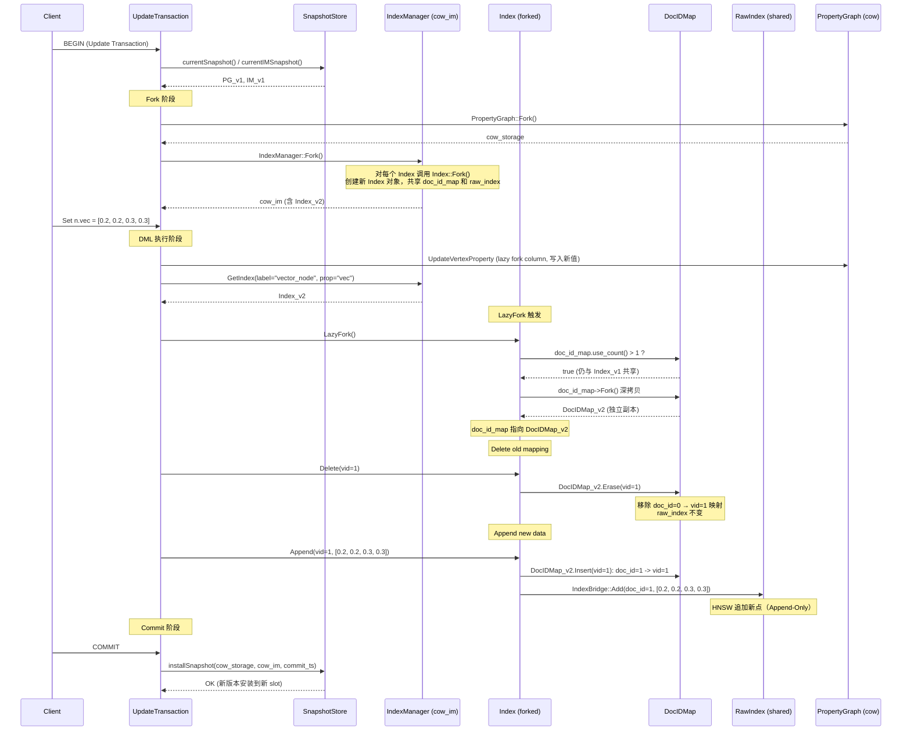
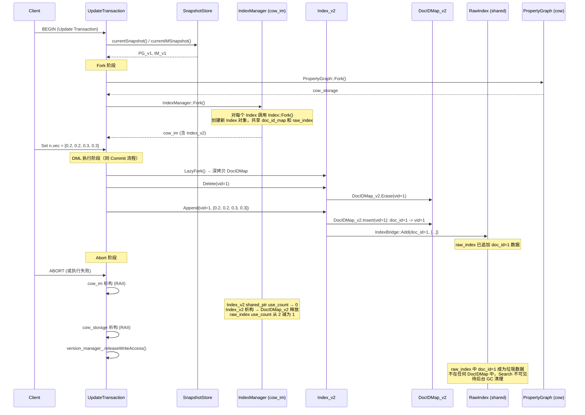
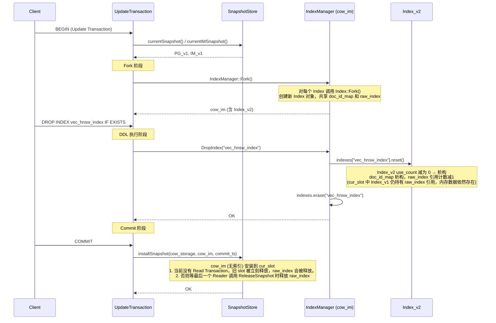
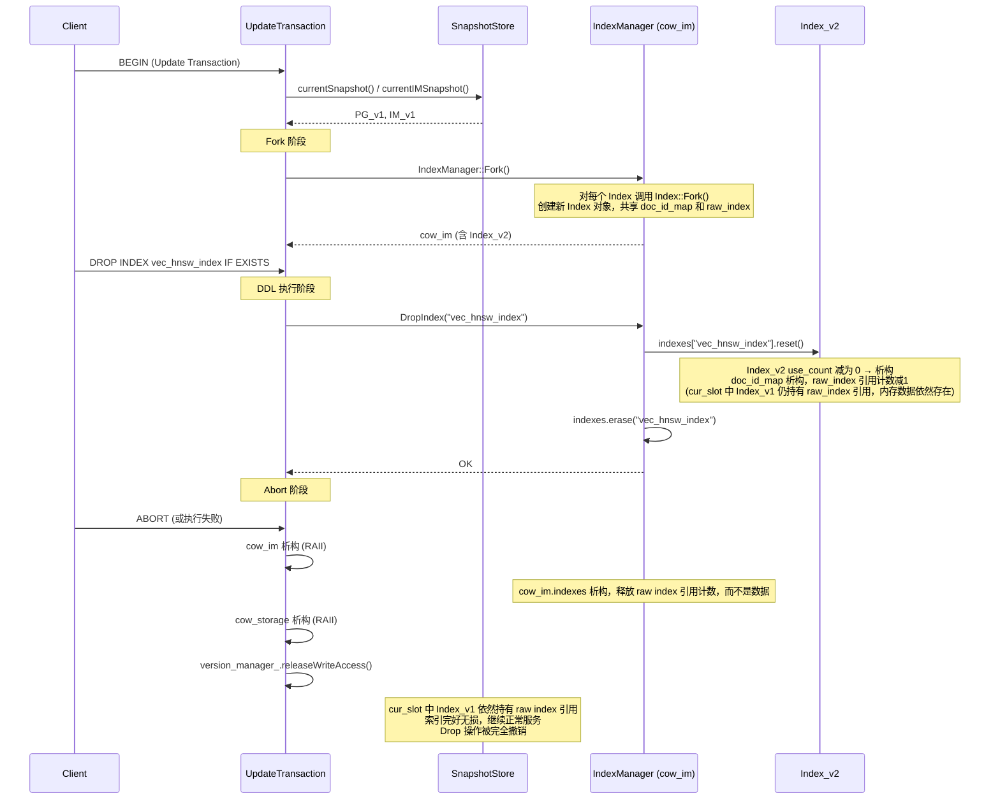
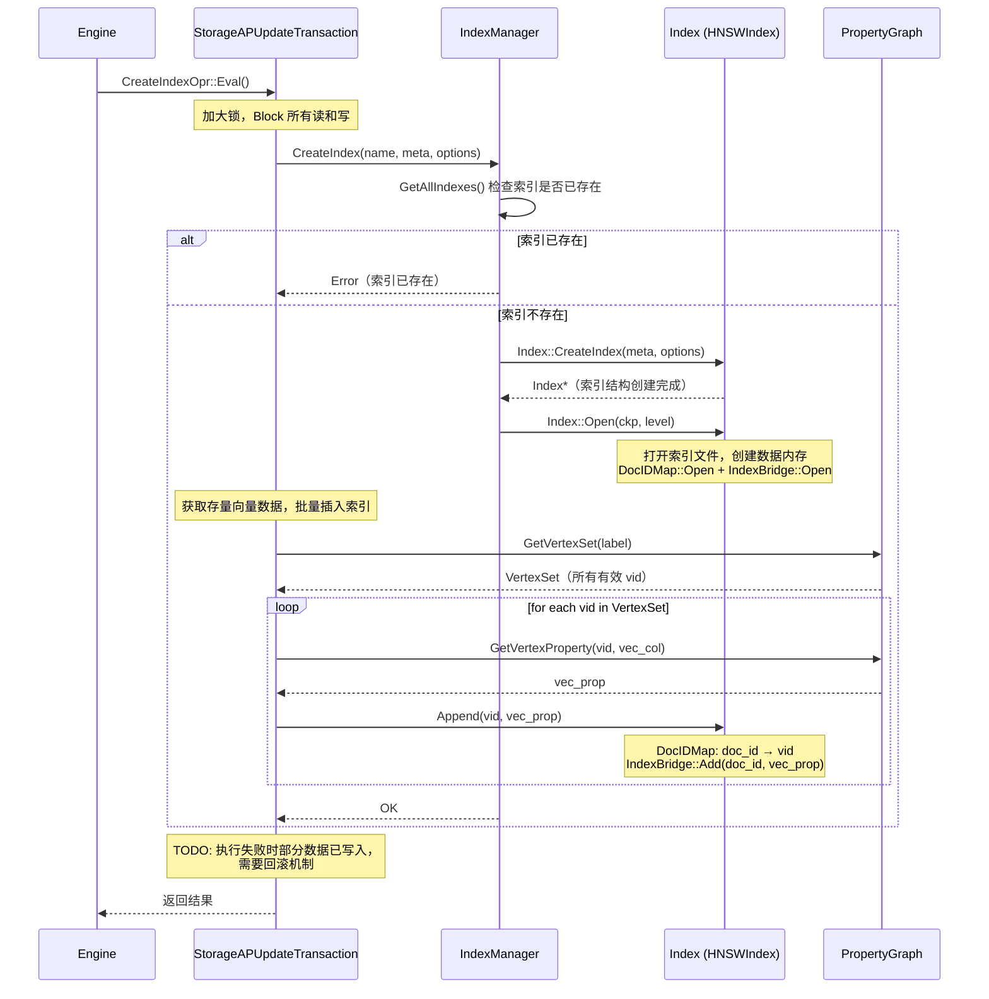

# NeuG 向量数据 + 索引 COW 设计

## 框架设计

目前 NeuG 支持向量数据库基本的思路是：
- NeuG 存储向量数据 + ZVec 存储向量索引
- 以 Extension 形式加载 ZVec，由 ZVec 提供向量索引+向量函数功能，Extension 仅依赖 ZVec Core 动态库，大约小几 MB 大小
- 由 NeuG 统一提供对数据/索引的 ACID & Checkpoint 机制，仅接入 ZVec Index 层，不包含 Collection 层功能


 


基于该思路的框架设计如下：
- Compiler
    - parser: 提供 create_index/drop_index/... 语法解析
    - optimizer: 提供索引优化，基于索引 cost 估计选择最优的 IndexScan
- Engine 
    - 提供数据/索引的 ACID 支持，提供三种 Transaction: Read/Insert/Update
    - 提供两种执行模式：AP or TP，在 AP 和 TP 下支持不同的操作类型
    - 表格汇总了索引相关操作在 AP/TP/Transaction 方面的支持计划
- Storage
    - PropertyGraph & IndexManager 都遵循 ACID
    - PropertyGraph (存储向量数据)
    - IndexManager (存储向量索引)
- ZVec Extension
    - 提供距离函数：vec_distance_l2, vec_distance_cosine, vec_slice，将这些函数注册进 FunctionManager
    - 提供 HNSWIndex, IVFIndex 具体实现，将索引实现注册进 IndexManager
 

索引相关操作支持计划：

| 操作类型       | 查询例子                        | AP   | TP     | Transaction                                                              |
| -------------- | ------------------------------- | ---- | ------ | ------------------------------------------------------------------------ |
| `create_index` | `CREATE INDEX ... USING HNSW`   | 支持 | 不支持 | 不支持 Transaction                                                       |
| `drop_index`   | `DROP INDEX ...`                | 支持 | 支持   | UpdateTransaction                                                        |
| `insert_data`  | `COPY FROM` / `CREATE (n:...)`  | 支持 | 支持   | UpdateTransaction（TP 下带索引的写一律为 Update，不带索引的写为 Insert） |
| `delete_data`  | `DELETE n`                      | 支持 | 支持   | UpdateTransaction                                                        |
| `update_data`  | `SET n.vec = [...]`             | 支持 | 支持   | UpdateTransaction                                                        |
| `search`       | `ORDER BY vec_distance_l2(...)` | 支持 | 支持   | ReadTransaction                                                          |

## 向量数据

```cypher
// FP32、dim=4 的定长数组作为向量列；主键与向量维度在 DDL 中一次声明
CREATE NODE TABLE vector_node (id INT64, vec FLOAT[4], PRIMARY KEY (id));
```

NeuG 通过 Array (定长数组) 支持向量属性类型，具体包括：

| Vector Types (ZVec 侧) | NeuG Types           | 说明         |
| ---------------------- | -------------------- | ------------ |
| `VECTOR(FP64, dim)`    | `ARRAY(DOUBLE, dim)` | 双精度浮点数 |
| `VECTOR(FP32, dim)`    | `ARRAY(FLOAT, dim)`  | 单精度浮点数 |

我们目前仅支持 Dense Vector，Sparse Vector 暂时不支持。对于向量 `[0.1, 0, 0, 0.4]`，我们仅支持 `[0.1, 0, 0, 0.4]` Dense 表示，而不支持 `{0: 0.1, 3: 0.4}` Sparse 表示。

**进一步说明：**
- 向量数据统一由 PropertyGraph 管理，存储为 ColumnBase 的具体实例，在 Read + Update Transaction 并发情况下，需要 COW，目前看起来这是一笔较大的开销。后续可以进一步考虑 append-only 存储方式，避免 copy-on-write，但不在第一阶段规划中。
- NeuG & ZVec 统一存储后，ZVec 需要访问 NeuG 向量存储，目前方案是由 ZVec 提供 Provider 接口，NeuG 提供特定实现：将 doc_id 经过 DocIDMap 转化为 vid，再通过 vid 访问向量数据。性能问题：HNSW 需要经过额外 id 映射才能访问到向量数据，需要面向性能设计 DocIDMap 相关结构。

## 索引接口

这里有几个关键设计:
- Append-Only: 索引被设计为 Append-Only，删点操作不会删除底层的 raw 索引数据，更新点不会 in-place 修改 raw 索引数据，而是通过追加新索引数据的方式
- DocIDMap: 这里有一个 doc_id 概念，不特指 HNSW ZVec 实现中的 doc_id，代表的是递增的 id 序列，每个索引都有该 map，用于区分不同 vid 以及 同一个 vid 不同版本的索引数据
- COW: 在 Read + Update Transaction 并发时，DocIDMap 会被深拷贝，每个 Transaction 拥有自己视图的 DocIDMap 数据；但 Raw Index 数据不会发生深拷贝，不同 Transaction 通过指针指向同一个 Raw Index 数据，因为索引数据是按照 doc_id 维护，相当于维护了不同版本的索引数据，不需要额外的拷贝

### DocIDMap 数据结构

DocIDMap 维护 doc_id -> vid 的映射，是索引 COW 的核心轻量数据结构。DocIDMap 有几个作用：
- 保存 doc_id -> vid 的映射，将索引 Search 到的 doc_id 进一步转化为 vid，返回点数据，可以接着执行下面的图操作
- 从 DocIDMap 中抽取出 doc_id bitmap，可以在索引 Search 过程中执行 MVCC 过滤
- NeuG & ZVec 统一存储后，ZVec 可以通过 doc_id -> vid 映射，访问存储在 NeuG 中的向量数据

DocIDMap 如何保证 ACID：
- 支持 COW，当 Read + Update Transaction 同时执行时，Update Transaction 会执行 `DocIDMap::Fork` 操作深拷贝自己的 DocIDMap 数据，与 Read Transaction DocIDMap 数据版本隔离
- 支持持久化，遵循 NeuG 统一的 checkpoint 机制，数据通过 NeuG IDataContainer 保存，基于 IDataContainer 支持：
	- Open：db open 时通过 MMAP 映射文件到内存，支持 MMAP_SHARED 和 MMAP_PRIVATE
 	- Dump：db close 时候将内存数据写入到文件中，通过先写数据副本 + 后更新 Manifest 方式保证原子性

DocIDMap 包含字段：
- buffer_: 保存 doc_id -> vid 数据的内存空间
- next_doc_id: 记录当前追加的 doc_id 数量

DocIDMap 继承 Module 接口，提供 Open/Dump 两个接口实现：
- Open 会在 DB:Open 时由框架统一调用，提供从文件中加载 buffer_ 和 next_doc_id 的功能
- Dump 会在 DB::Close 或者 Checkpoint 时由框架统一调用，提供持久化 buffer_ 和 next_doc_id 到文件功能，其中 buffer_ 保存在单独文件中，文件地址和 next_doc_id 保存在 Manifest 中

DocIDMap 在 Manifest 中结构：
```
meta JSON
└── modules
    ├── "vertex_table_Person"                        ← PropertyGraph::Dump 设置的 key
    │   └── ...
    │
    └── "index_vec_hnsw"                             ← 索引模块
        ├── module_type: "index"
        └── sub_modules
            ├── "doc_id_map"                         ← DocIDMap 模块
            │   ├── extra: { next_doc_id: "1024" }   ← 标量状态（持久化在 meta JSON 中）
            │   └── sub_modules
            │       └── "buffer" → { path: "snapshot/iii-9999" }   ← DocIDMap 数据文件
            │
            └── "zvec_index" → { path: "snapshot/jjj-0000" }      ← Raw Index 数据文件
```

```c++
class DocIDMap : Module {
public:
	// 当前 doc_id 数量
	size_t size() {
		return next_doc_id;
	}

	// 当前数据缓冲区大小
    size_t capacity() {
		return buffer_->size();
	}

	// 实现 Module::Open 接口，在 db open 时打开 DocIDMap 文件
	virtual void Open(Checkpoint& ckp, const ModuleDescriptor& descriptor,
                    MemoryLevel level) override {
		// 从 Manifest 文件中载入 next_doc_id
		next_doc_id.store(std::stoull(desc.get("next_doc_id").value_or("0")));
		// 调用 Checkpoint::OpenFile 从文件中加载 buffer_ 数据
		buffer_ = ckp.OpenFile(desc.get_sub_module("buffer").path, mem_level);
	}

	// 实现 Module::Dump 接口，在 db close / checkpoint 时候调用
	// 返回 Manifest，用于持久化元数据：文件地址，next_doc_id
	virtual ModuleDescriptor Dump(Checkpoint& ckp) override {
		ModuleDescriptor out_desc;
		// 持久化 next_doc_id 到 Manifest
		out_desc.set("next_doc_id", std::to_string(num_elements_.load()));
		// 调用 Checkpoint::Commit 将内存数据持久化到文件中
		ModuleDescriptor buffer_desc;
    	buffer_desc.path  = ckp.Commit(buffer_);
		out_desc.set_sub_module("buffer", std::move(buffer_desc));
		return out_desc;
	}

	// 插入索引数据之前判断 size >= capacity, if true -> resize
	// 调用 buffer_->resize(size); 通过 MMAP 操作扩容，buffer_ 直接指向 mmap 扩容后的内存地址
  	void Resize(size_t size) {
		buffer_->Resize(size_ * sizeof(vid));
	}
   
    // 分配一个新的 doc_id 并建立 doc_id -> vid 的映射
    doc_id_t Insert(vid_t vid) {
        doc_id_t new_id = next_doc_id_++;
        buffer_[new_id] = vid;
        return new_id;
    }

    // 删除意义不大，doc_id 递增分配，之前的 doc_id 无法回收或复用
    void Erase(vid_t vid) {
		// do nothing
	}

    // 查找 doc_id 对应的 vid，不存在返回 INVALID_VID
	// 效率 O(1)，doc_id 线性寻址
    // ZVec 可以通过这个映射访问到 NeuG 向量数据
    vid GetVID(doc_id_t doc_id) {
		return buffer_[doc_id];
	}

    // 支持 Transaction
    // COW：创建 DocIDMap 的深拷贝
    std::unique_ptr<DocIDMap> Fork(Checkpoint& ckp, MemoryLevel level) const {
        auto forked_map = std::make_unique<DocIDMap>();
		// 深拷贝 buffer 数据
        forked.buffer_ = buffer_->Fork();
        forked.next_doc_id_ = next_doc_id_;
        return std::move(forked_map);
    }

private:
	// 保存 doc_id -> vid 映射数据的连续内存
	// 通过 mmap 将文件数据映射到内存页面，buffer_ 指向 mmap 分配内存地址
	std::unique_ptr<IDataContainer> buffer_;
	doc_id_t next_doc_id; // 当前已追加 doc_id 数量，持久化到 Manifest 中
};
```

**设计要点**：
- `next_doc_id_` 是全局递增的，fork 后的副本从当前最新值继续分配，保证 doc_id 在 raw index 中的唯一性
- DocIDMap 是轻量数据结构，Fork 开销与索引点数量线性相关，但远小于 raw index data 的拷贝开销

### Index 类定义

Index 提供索引的基本接口，提供 Search / Append 接口。

索引元数据：
```c++
struct IndexMeta {
    // 索引 unique_name，例如 'vec_hnsw_index'
    std::string name;
    // 索引类型名称，例如 'HNSW'
    std::string type;
    // 索引绑定的 label, properties 信息
    // 可以支持 vertex or triplet edge type
    IndexBindSchema schema;
};

struct IndexBindSchema {
    LabelEntry label;
    // 一个索引可能绑定多个属性，虽然目前 NeuG 支持的只有一列属性
    std::vector<int> property_ids;
    std::vector<std::string> property_names;
    std::vector<neug::DataType> property_types;
}

// denote a vertex or triplet edge type
struct LabelEntry {
    ...
};
```

索引提供的基本功能函数：
- 构造函数：传入 index_unique_name，元数据，options，NeuG transaction (用于 ZVec 访问向量数据) 参数
- Search：传入 query params (用于构造查询参数)，filter params (用于执行 MVCC 或者标量属性过滤)，返回查询结果的 vid 集合
- Append：按 vid 插入索引数据，Append 前按需执行扩容操作，递增分配 doc_id，插入 <doc_id，向量数据> 到索引，并保存 doc_id -> vid 映射
- Delete：Append-Only 设计，无法物理删除物理数据，do nothing；不提供 Update 操作，Update 操作需要上层调用转化为 Delete + Append

索引提供 Transaction 功能函数：
- Fork: 在 Update Transaction 刚创建时调用，浅拷贝内部数据，doc_id_map 和 raw index 指针各 + 1
- LazyFork: 在真正发生写入，例如 AddVertex 时调用，深拷贝 DocIDMap 数据，doc_id_map 指针指向新拷贝数据，raw index 不会深拷贝，指针保持不变

索引继承 Module 接口，实现 Open/Dump 接口，由 Checkpoint 框架统一调用：
- Open: 打开 DocIDMap 数据文件，由 DocIDMap::Open() 提供实现；打开索引数据文件，由 ZVec IndexBridge::Open() 提供实现
- Dump: 持久化 DocIDMap，由 DocIDMap::Dump() 提供实现；持久化索引数据文件，由 ZVec IndexBridge::Flush() 提供实现

```c++
class Index : Module {
public:
    // 创建新索引
    Index(
        const std::string &name, // 索引 unique_name
        const IndexMeta &meta, // 索引元数据
        case_insensitive_map_t<Value> &options, // WITH (metric='cosine', ef_search=...)
		const IStorageInterface &transaction); // 用于 ZVec 访问 NeuG 向量存储数据 
 
    virtual void Open(Checkpoint& ckp, const ModuleDescriptor& descriptor,
                    MemoryLevel level);

    virtual ModuleDescriptor Dump(Checkpoint& ckp);
    
    // 查询接口
    Status Search(
        const IndexQueryParams &params, // 索引参数，根据不同索引定义不同实现
		// 在索引 Search 过程中执行 MVCC、属性、子图过滤
        const IndexFilterParams &filter_params,
        std::vector<vid_t> &results // 返回点集结果
        );

    // 按点插入接口
    Status Append(
        vid_t vid, // 当前新增点
        const std::vector<Property> &values // 当前新增点的属性
    ) {	
		// 插入点之前判断是否需要扩容
		if (doc_id_map->Size() >= doc_id_map->Capacity()) {
			doc_id_map->Resize(new_capacity);
		}
        // 递增分配 doc_id
		doc_id_t doc_id = doc_id_map.Insert(vid);
		// 调用具体索引实现，将 doc_id 以及属性数据插入索引
    }

    // 按点删除：仅删除 DocIDMap 中的数据，不删除底层 raw 索引数据
    Status Delete(vid_t vid) {
		doc_id_map->Erase(vid);
	}

    // 没有更新接口，实现为 delete + append
    // Status Update(
    //     vid_t vid, // 更新点
    //     const std::vector<Property> &new_values // 更新点的新属性
    //     );

    // 创建新的 Index 对象，内部 doc_id_map 和 raw index 通过 shared_ptr 共享（引用计数各 + 1）
    std::shared_ptr<Index> Fork() const {
        auto forked = std::make_shared<Index>(...);
        // doc_id_map shared_ptr 拷贝，引用计数 + 1
        forked->doc_id_map = doc_id_map;
        // raw index shared_ptr 拷贝，引用计数 + 1
        forked->raw_index_ = raw_index_;
        return std::move(forked);
    }

    // COW: Lazy Fork
    // 仅在真正发生数据更新的时候调用，如果 doc_id_map 引用计数 > 1，
	// 创建新 DocIDMap 数据副本，并更新 doc_id_map shared_ptr
    // raw index shared_ptr 保持不变，指向同一份底层索引数据
    void LazyFork() {
        if (doc_id_map.use_count() > 1) {
            auto forked_map = doc_id_map.Fork();
            doc_id_map = std::shared_ptr<DocIDMap>(dynamic_cast<DocIDMap*>(forked_map.release()));
        }
    }

protected:
    std::shared_ptr<DocIDMap> doc_id_map;
};
```

HNSWIndex 继承 Index 接口：
```c++
class HNSWIndex : Index {
private:
    // 索引数据由 ZVec Index 维护
    std::shared_ptr<IndexBridge> zvec_index;
}
```

### IndexFilter

IndexFilter 用于在索引搜索过程中执行 NeuG 语义的过滤操作，提高召回率，具体包括：

- MVCC 过滤：过滤掉不在当前数据版本中的 doc_id
- 属性过滤：标量属性过滤，索引搜索过程中的点得满足标量过滤条件
- 子图过滤：图查询+向量搜索混合执行，索引搜索过程中的点得满足子图过滤条件

```c++
class Index {
public:
    // 查询接口
    Status Search(
        const IndexQueryParams &params, // 索引参数，根据不同索引定义不同实现
		// 在索引 Search 过程中执行 MVCC、属性、子图过滤
        const IndexFilterParams &filter_params,
        std::vector<vid_t> &results // 返回点集结果
        );
}

struct IndexFilterParams {
	// 保存当前版本数据
	const DocIDMap &doc_id_map;
	// 子图过滤结果，也包括属性过滤
	// Match (n:vec_node) Where n.age > 10 Return n ...
	// or 
	// Match (n:vec_node {id: 1})-[:links]->[n2:vec_node] Return n2 ...
	const gs::Context &ctx;
}
```

HNSWIndex 实现中，基于 ZVec::IndexFilter 接口实现 NeuG 自己的过滤逻辑，主要是将保存在 DocIdMap 中 doc_id 和 保存在 Context 中 vid 集合统一组装成 ZVec BitMap 结构，让 ZVec 在搜索过程中 O(1) 效率执行过滤

```c++
class HNSWIndexFilter : IndexFilter {
public:
	HNSWIndexFilter(const IndexFilterParams &params);

	/**
	* @return true if the document is filtered (should be excluded)
	* @return false if the document is not filtered (should be included)
	*/
	virtual bool is_filtered(uint64_t id);
private:
	roaring_bitmap_t *bitmap;
};
```

子图过滤主要用来处理图+向量搜索混合执行的场景。例如对于下面的查询：

```cypher
Match (n:vector_node)
Where n.age > 10
Return n
Order by vec_distance_l2(n.vec, [0.1, 0.1])
Limti 10;
```

NeuG 基于 cost estimation 可能生成以下两种 Plan:

- Plan1: n.age > 10 的过滤程度不高，比如会保留 90% 点。这种情况，NeuG 会先执行图查询，将过滤出来的点保存在 context，基于 ZVec HNSW 进一步搜索

	```
	Scan(label=vector_node, n.age > 10)
	ProcedureCall(
		index_scan_function(
			// 基于 doc_id_map, context 进一步构建 ZVec IndexFilter
			IndexFilterParams(doc_id_map, context), vector=[0.1, 0.1], topk=10)
	)
	Project(n)
	```

- Plan2: n.age > 10 的过滤程度高，仅保留 10% 点。直接计算距离并排序

	```
	Scan(label=vector_node, n.age > 10)
	Project(
		n as n,
		vec_distance_l2(n.vec, [[0.1, 0.1]]) as score
	)
	Order(score, limit=10)
	Project(n)
	```

### Checkpoint

索引 Checkpoint 需要持久化 DocIDMap 以及 raw index 数据，两部分数据分别存储在两个文件中，索引数据的落盘由具体索引实现，在 ZVec HNSW 中由 `IndexBridge::Flush()` 操作提供落盘操作。

NeuG DB::Open() 流程：
```
NeugDB::Open(config)
├── Workspace::Open(data_dir)                     // 扫描加载所有 checkpoint
├── PropertyGraph::Open(ckp, memory_level)        // 从 HEAD checkpoint 打开图
│   ├── VertexTable::Open(ckp, desc, level)       // 每个 vertex_label
│   │   ├── indexer_->Open(ckp, desc, level)      // 主键索引 (LFIndexer)
│   │   ├── table_->Open(ckp, desc, level)        // 属性表 (Table)
│   │   │   └── 每列 → ckp.OpenFile(path, level)  // 列数据文件
│   │   └── v_ts_->Open(ckp, desc, level)         // 顶点时间戳
│   └── EdgeTable::Open(ckp, desc, level)         // 每个 edge_triplet
│       ├── ie_/oe_ CSR::Open(ckp, desc, level)   // 入边/出边 CSR
│       └── table_->Open(ckp, desc, level)         // 边属性表
├── ingestWals(wal_parser, graph)                  // 重放 WAL 恢复增量数据
└── SnapshotStore(128, graph, last_ts)             // 安装到 slot_0
```

NeuG Checkpoint 流程：
```
NeugDB::createCheckpoint()
├── Workspace::CreateCheckpoint()                  // 创建新 checkpoint 目录
└── PropertyGraph::Dump(ckp_new)                   // 逐模块提交到新 checkpoint
    ├── VertexTable::Dump(ckp_new)                 // 每个 vertex_label
    │   ├── indexer_->Dump(ckp_new)                // → ckp.Commit(keys/indices)
    │   ├── table_->Dump(ckp_new)                  // → 每列 ckp.Commit(col_buf)
    │   └── v_ts_->Dump(ckp_new)                   // → ckp.Commit(ts_buf)
    ├── EdgeTable::Dump(ckp_new)                   // 每个 edge_triplet
    │   ├── ie_/oe_ CSR::Dump(ckp_new)
    │   └── table_->Dump(ckp_new)
    └── ckp_new.UpdateMeta(meta)                   // 原子写入 Manifest
```

Open/Dump 都是由框架层统一调用，索引只要实现具体的 Open/Dump 操作。

```c++
class HNSWIndex : Index {
public:
    // 实现 Module::Open 接口
    void Open(Checkpoint& ckp, const ModuleDescriptor& desc,
                    MemoryLevel level) override {
        // 1. 从 Manifest 中获取 DocIDMap 信息，
        // 打开 DocIDMap，恢复 next_doc_id 和 buffer_ 数据
        doc_id_map->Open(ckp, desc.get_sub_module("doc_id_map"), level);
        // 2. 从 Manifest 中获取 ZVec Index 信息，
        // 构建 ZVec 文件打开参数，通过 IndexBridge 打开
        ZVecOpen(ckp, desc.get_sub_module("doc_id_map"), level);

    }

    // 通过 IndexBridge::Open() 打开索引
    // checkpoint_path = "checkpoint-01/..."
    void ZVecOpen(Checkpoint& ckp, const ModuleDescriptor& zvec_desc,
                    MemoryLevel level) {
        // 设置文件打开模式
        if (level == kInMemory) {
            // MMAP_PRIVATE，COW 语义
            zvec_params.storage_options = kMMAP;
            zvec_params.copy_on_write = true;
        } else if (level == kSyncToFile) {
            // MMAP_SHARED
            zvec_params.storage_options = kMMAP;
            zvec_params.copy_on_write = false;
        }
        // 创建 runtime 文件副本，保证文件写入原子性，防止数据写回污染 snapshot 文件
        // checkpoint-01/snapshot/aaa -> checkpoint-01/runtime/aaa
        zvec_runtime_path_ = ckp.CreateRuntimeCopy(zvec_desc, level);
        zvec_index_ = IndexBridge::Open(zvec_runtime_path_, zvec_params);
    }

    // 实现 Module::Dump 接口
    // checkpoint_path = "checkpoint-02/..."
    ModuleDescriptor Dump(Checkpoint& ckp) override {
        ModuleDescriptor out_desc;
        out_desc.module_type = "index";

        // 1. 通过 DocIDMap::Dump() 持久化，并保存 Manifest 信息
        out_desc.set_sub_module("doc_id_map", doc_id_map->Dump(ckp));

        // 2. Dump ZVec Index（通过适配器走 Commit）
        ZVecDumpContainer zvec_container(zvec_index_.get(), zvec_runtime_path_);
        ModuleDescriptor zvec_desc;
        zvec_desc.path = ckp.Commit(zvec_container);
        out_desc.set_sub_module("zvec_index", std::move(zvec_desc));

        return out_desc;
    }

private:
    std::unique_ptr<DocIDMap> doc_id_map;
    std::shared_ptr<IndexBridge> zvec_index_;
    std::string zvec_runtime_path_;
};
```

Checkpoint::Commit 实际实现：
```cpp
// Checkpoint::Commit 实际实现
std::string Commit(IDataContainer& buffer) {
    // 路径1: 没有写入修改 → hardlink（零拷贝共享）
    // checkpoint-01/snapshot/aaa -> checkpoint-02/snapshot/aaa
    if (!buffer.IsDirty() && !buffer.GetPath().empty()) {
        return LinkToSnapshot(buffer.GetPath());
    }
    ...
    // 路径2: 有写入修改 → Dump runtime，再 rename snapshot
    // 将内存数据写回到 checkpoint-01/runtime/aaa 文件
    buffer.Sync();
    // 创建新文件 checkpoint-02/runtime/aaa
    auto uuid = create_runtime_object();
    // Dump 实现为 fwrite 或 rename，
    // 例如将 checkpoint-01/runtime/aaa -> checkpoint-02/runtime/aaa
    buffer.Dump(runtime_dir() + "/" + uuid);
    // rename checkpoint-02/runtime/aaa -> checkpoint-02/snapshot/aaa
    return CommitRuntimeObject(uuid);
}
```

主要调用 IDataContainer 中的四个接口：

| 接口         | 作用                                          |
| ------------ | --------------------------------------------- |
| `IsDirty()`  | 判断数据是否修改，决定能否走 hardlink 快路径  |
| `GetPath()`  | 获取当前文件路径                              |
| `Sync()`     | 将内存脏页刷到当前 runtime 文件               |
| `Dump(path)` | 将数据写出到目标路径（fwrite 或 Sync+rename） |

适配器：将 ZVec 索引文件操作适配为 IDataContainer 接口
```c++
// 适配器：将 ZVec 索引文件操作适配为 IDataContainer 接口
// 使得 ZVec 索引文件可以通过 Checkpoint::Commit() 统一提交
class ZVecDumpContainer : IDataContainer {
public:
    ZVecDumpContainer(IndexBridge* index, const std::string& runtime_path)
        : zvec_index_(index), runtime_path_(runtime_path) {}

    // 数据是否发生修改，没有修改直接走 hardlink 快路径
    bool IsDirty() override {
        // ZVec Index 是否可以提供 IsDirty 接口？
        return zvec_index_->IsDirty();
    }

    // 获取索引文件的 runtime_path
    std::string GetPath() override {
        return runtime_path_;
    }

    // 基于 ZVec Flush 操作，将内存数据刷新到 runtime 文件中
    void Sync() override {
        zvec_index_->Flush();
    }

    // 将 runtime_path 重命名为 new_path
    // Commit 会调用此方法
    void Dump(const std::string& new_path) override {
        Sync();
        std::filesystem::rename(runtime_path_, new_path);
    }

private:
    IndexBridge* zvec_index_;
    std::string runtime_path_;
};
```

Dump 完成后，Manifest 会保存索引文件信息:
```
meta JSON
└── modules
    ├── "vertex_table_Person"                    ← PropertyGraph::Dump 设置的 key
    │   ├── module_type: "vertex_table"
    │   └── sub_modules
    │       ├── "indexer"                        ← LFIndexer
    │       │   ├── extra: { num_elements, num_slots_minus_one, hash_policy }
    │       │   └── sub_modules
    │       │       ├── "keys"    → { path: "snapshot/fff-6666" }
    │       │       └── "indices" → { path: "snapshot/ggg-7777" }
    │       │
    │       ├── "property_table"                 ← PropertyTable（包含所有属性列）
    │       │   └── sub_modules
    │       │       ├── "age"  → { path: "snapshot/bbb-2222", size: 10000 }
    │       │       └── "name" → { sub_modules: { items: ..., data: ... } }
    │       │
    │       └── "vertex_timestamp"               ← VertexTimestamp
    │           └── { path: "snapshot/hhh-8888" }
    │
    └── "index_vec_hnsw"                             ← 索引模块
        ├── module_type: "index"
        └── sub_modules
            ├── "doc_id_map"                             ← DocIDMap 模块
            │   ├── extra: { next_doc_id: "1024" }       ← 标量状态（持久化在 meta JSON 中）
            │   └── sub_modules
            │       └── "buffer" → { path: "snapshot/iii-9999" }   ← DocIDMap 数据文件
            │
            └── "zvec_index" → { path: "snapshot/jjj-0000" }      ← Raw Index 数据文件
```

## IndexManager

IndexManager 统一管理所有的索引接口，有几个关键设计：
- IndexManager 通过 `shared_ptr` 来管理索引结构，也就是通过 `shared_ptr::use_count` 来管理索引的生命周期
- 在执行 DropIndex 操作时，我们直接通过 `indexes[name].reset()` 操作将当前索引的引用计数减1，在 `releaseSnapshot` 操作中当该引用计数减少为 0 时，索引内存结构才真正被回收释放，DocIDMap 和 raw index 内存数据都会被删除，磁盘数据会在 checkpoint 阶段被删除。
- IndexManager 提供 Open/Dump 入口，调用每一个索引的 Open/Dump 实现；Dump 阶段只会调用未删除索引的 Dump 方法，并只会保存未删除索引的 Manifest 信息，Dropped Index 索引文件不会再出现在新 checkpoint 目录

```c++
class IndexManager {
public:
    // 创建索引结构并返回指针
    Result<Index*> CreateIndex(
        const std::string &name,
        const IndexMeta &meta,
        case_insensitive_map_t<Value> &options);
    
    // 由 DB::Open() 框架统一调用，内部调用各个索引的 Open 实现
    void Open(Checkpoint& ckp, MemoryLevel memory_level);
    // 由 Checkpoint() 框架统一调用，
    // 1. 先写数据副本，调用各个索引的 Dump 实现将数据写入到新 checkpoint 目录下
    // 2. 后写 Manifest，统一构建索引的 Manifest 结构保存至 SnapshotMeta，并原子更新
    SnapshotMeta Dump(Checkpoint& ckp, bool reopen = true);

    Status DropIndex(const std::string &name) {
        auto it = indexes.find(name);
        if (it == indexes.end()) return Status::NotFound();
        // 引用计数减1，旧 slot 仍持有 shared_ptr，
        // 直到 ReleaseSnapshot，旧 slot 释放引用计数为0时，该索引内存数据才会被真正删除
        it->second.reset(); 
        indexes.erase(it);
        return Status::OK();
    }

    Status GetIndex(
        const LabelEntry &label,
        const std::vector<std::string> property_names,
        std::vector<Index*> &target_index // 返回特定属性列的所有索引
    );

    Status GetAllIndexes(
        std::vector<Index*> &target_index // 返回所有索引
    );

    // 对每个 Index 调用 Fork()，创建新的 Index 对象
    // 新 Index 对象内部的 doc_id_map 和 raw index 通过 shared_ptr 与原始 Index 共享
    std::shared_ptr<IndexManager> Fork() const {
        auto forked = std::make_shared<IndexManager>();
        forked->indexes.reserve(indexes.size());
        for (size_t i = 0; i < indexes.size(); ++i) {
            forked[i] = std::move(indexes[i].Fork());
        }
        return forked;
    }

private:
    // 通过 name -> shared_ptr 映射管理索引
    std::unordered_map<std::string, std::shared_ptr<Index>> indexes;
};
```

**Fork 设计要点**：
- `IndexManager::Fork()` 对每个 Index 调用 `Index::Fork()`，创建新的 Index 对象，新 Index 与原始 Index 通过 `shared_ptr` 共享内部的 `doc_id_map` 和 `raw_index`
- 当 Update Transaction 需要修改某个 Index 的 DocIDMap 时（Append/Delete），在该 Index 上调用 `LazyFork()`，检测 `doc_id_map.use_count() > 1` 时深拷贝 DocIDMap，使当前 Index 持有独立的 DocIDMap 副本
- DropIndex 在 cow 副本上只是从 map 中移除 entry 并 reset shared_ptr，原始 slot 中的 Index 对象不受影响，直到 ReleaseSnapshot 阶段，原始 slot 释放引用计数为0时，该索引内存结构才真正被释放

## 索引 COW 架构设计

NeuG 通过 COW 机制维护了多个版本的图数据，用于 read + update 并发查询的版本隔离。索引数据是否可以支持 COW 呢？

我们将索引数据分为两部分来讨论：
- raw index data：底层索引数据，比如 zvec hnsw 索引数据，数据量大
- DocIDMap：例如 doc_id -> vid 这样的映射，轻量数据

raw index data 实现 COW 开销非常大，比如 zvec hnsw 索引的存储开销来自两部分：
- graph_neighbors: 每一个 doc_id 在多层的邻居
- 向量数据：zvec 会将向量数据拷贝到内部缓冲区

结合以上因素，目前提出的方案是：
- raw index data: 不实现 COW，所有 transaction 共享同一个全局索引视图，每一个 transaction 写入都是直接追加全局索引数据
- raw index 版本隔离：同一个 vid 可能对应多个版本 (doc_id) 的索引数据（点更新，删除+新增后点槽位复用），这些 doc_id 全部存储于同一个全局索引中。每个 transaction 通过本地的 DocIDMap 支持索引数据的版本隔离
- DocIDMap: 支持 COW，每一个 update transaction 通过 lazy fork 创建本地 mapping 视图 ，保证和其他 read transaction 的版本隔离
- GC: 提供统一的 compact，用于定期或者 Checkpoint 时清理垃圾 doc_id，直接重建索引

### Index::LazyFork 实现

```c++
// void 方法，在当前 Index 对象上原地深拷贝 DocIDMap
// 调用时机：Append/Delete 前检测到 doc_id_map 仍与其他 Index 共享时
void Index::LazyFork() {
    if (doc_id_map.use_count() > 1) {
        auto forked_map = doc_id_map->Fork();
		// 旧 doc_id_map 引用指针 -1，重新指向新 doc_id_map
        doc_id_map = std::shared_ptr<DocIDMap>(dynamic_cast<DocIDMap*>(forked_map.release()));
    }
}
```

**设计要点**：
- `LazyFork()` 是 void 方法，不创建新 Index 对象，仅在当前 Index 上深拷贝 DocIDMap
- 通过 `doc_id_map.use_count() > 1` 判断是否仍与其他 Index（来自 `Index::Fork()` 的浅拷贝）共享同一个 DocIDMap
- 深拷贝后，当前 Index 持有独立的 DocIDMap 副本，原始 Index 的 DocIDMap 不受影响
- raw index data 始终共享，不做任何拷贝
- Append 操作直接写入共享的 raw index data，同时在当前 Index 的 DocIDMap 中新增映射
- Search 时通过当前 Index 的 DocIDMap 过滤 raw index 返回的候选集

### COW 分层策略

与 PropertyGraph 的 COW 类似，索引 COW 也采用**两层 fork**：

1. **第一层 — IndexManager Fork（UpdateTransaction 开始时执行）**：`IndexManager::Fork()` 创建新的 IndexManager，对每个 Index 调用 `Index::Fork()` 创建新 Index 对象，新旧 Index 通过 `shared_ptr` 共享内部 `doc_id_map` 和 `raw_index`
2. **第二层 — DocIDMap lazy fork（DML 执行时按需触发）**：当 Update Transaction 需要修改某个 Index（Append/Delete）时，调用 `Index::LazyFork()`，检测 `doc_id_map.use_count() > 1` 时深拷贝 DocIDMap，使当前 Index 持有独立副本

```c++
// UpdateTransaction 中修改索引时的 lazy fork 触发
void UpdateTransaction::UpdateVertexWithIndex(label_t label, vid_t vid,
                                               const std::vector<Property> &new_values) {
    // ... PropertyGraph 相关操作省略 ...

    // 获取该 label + property 对应的索引
    std::vector<Index*> target_indexes;
    cow_index_manager_->GetIndex(label_entry, property_names, target_indexes);

    for (auto* idx : target_indexes) {
        // Lazy fork: 检查 doc_id_map 是否仍与其他 Index 共享，如果是则深拷贝
        idx->LazyFork();

        // Update -> Delete + Append
        // 在独立 DocIDMap 上操作：delete old + append new
        idx->Delete(vid);
        // 分配新 doc_id，追加到全局 raw index
        // 但 doc_id -> vid 新映射仅被修改到当前 DocIDMap 副本中
        idx->Append(vid, new_values);
    }
}
```

### 具体流程

我们通过两个例子来具体说明；假设当前 Schema & Index 为：

```cypher
// FP32、dim=4 的定长数组作为向量列；主键与向量维度在 DDL 中一次声明
CREATE NODE TABLE vector_node (id INT64, vec FLOAT[4], PRIMARY KEY (id));
```

```cypher
// 创建 vec 属性 HNSW 索引，label = 'vector_node'
CREATE INDEX vec_hnsw_index
ON vector_node
USING HNSW (vec)
WITH (metric = 'cosine');
```

#### Update Vertex Property

```cypher
Match (n:vector_node)
Where n.id = 1
Set n.vec = [0.2, 0.2, 0.3, 0.3]
```

##### 时序流程图



##### Abort 时序流程图



##### 状态图

有两个 Transaction T1, T2，

T1 Read Transaction:
```cypher
Match (n:vector_node)
Return n.vec
Order By vec_distance_l2(n.vec, [0.1, 0.2, 0.1, 0.2])
Limit 10;
```

T2 Update Transaction:
```cypher
Match (n:vector_node)
Where n.id = 1
Set n.vec = [0.2, 0.2, 0.3, 0.3]
```

假设初始状态下，索引中已有 vid=1 对应 doc_id=0，向量为 [0.1, 0.1, 0.1, 0.1]。

###### 初始内存状态（只有一个 Snapshot slot）

```
slot_0 (cur_slot_index_ = 0, reader_count = 0):
├── PG_v1 (PropertyGraph)
└── IM_v1 (IndexManager)
    └── indexes["vec_hnsw_index"] → shared_ptr<Index> (use_count=1)
        ├── DocIDMap: { vid=1 → doc_id=0 }
        └── raw_index: HNSW { doc_id=0 → [0.1, 0.1, 0.1, 0.1] }
```

###### Step 1: T1 (Read) 开始 — acquireSnapshot

```
slot_0 (reader_count = 1):  ← T1 登记
├── PG_v1
└── IM_v1
    └── indexes["vec_hnsw_index"] → shared_ptr<Index> (use_count=1)
        ├── DocIDMap: { vid=1 → doc_id=0 }
        └── raw_index: HNSW { doc_id=0 → [0.1, 0.1, 0.1, 0.1] }

T1 持有:
├── SnapshotHandle { slot_index=0 }
├── GraphView (裸指针展开，指向 PG_v1)
└── IndexManagerView (裸指针展开，指向 IM_v1 中的 Index)
    └── 持有 DocIDMap 的 const 引用 → { vid=1 → doc_id=0 }
```

###### Step 2: T2 (Update) 开始 — Fork

`IndexManager::Fork()` 对每个 Index 调用 `Index::Fork()`，创建新 Index 对象，内部 doc_id_map 通过 shared_ptr 共享：

```
slot_0 (reader_count = 1):  ← T1 仍在
├── PG_v1
└── IM_v1
    └── indexes["vec_hnsw_index"] → shared_ptr<Index_v1> (use_count=1)
        ├── doc_id_map → shared_ptr<DocIDMap> (use_count=2) ← cow Index 也指向它
        │       { vid=1 → doc_id=0 }
        └── raw_index → shared_ptr<RawIndex> (use_count=2)
                HNSW { doc_id=0 → [0.1, 0.1, 0.1, 0.1] }

T2 持有（线程私有）:
├── cow_storage (PropertyGraph COW 副本)
└── cow_im (IndexManager Fork 副本)
    └── indexes["vec_hnsw_index"] → shared_ptr<Index_v2> (use_count=1) ← 新 Index 对象
        ├── doc_id_map → shared_ptr<DocIDMap> (use_count=2) ← 与 Index_v1 共享
        │       { vid=1 → doc_id=0 }
        └── raw_index → shared_ptr<RawIndex> (use_count=2) ← 与 Index_v1 共享
```

###### Step 3: T2 执行 Set n.vec — Lazy Fork 触发

T2 执行 `UpdateVertexProperty`，需要修改 vec 属性并更新索引：

1. PropertyGraph 层面：lazy fork vec column（省略）
2. Index 层面：调用 `Index_v2->LazyFork()`，检测 `doc_id_map.use_count() == 2 > 1`，深拷贝 DocIDMap

```
slot_0 (reader_count = 1):
├── PG_v1
└── IM_v1
    └── indexes["vec_hnsw_index"] → shared_ptr<Index_v1> (use_count=1)
        ├── doc_id_map → shared_ptr<DocIDMap_v1> (use_count=1) ← 不再被 cow Index 共享
        │       { vid=1 → doc_id=0 }
        └── raw_index ─────────────────────────────┐
                                                    │ 共享
T2 cow_im:                                         │
└── indexes["vec_hnsw_index"] → shared_ptr<Index_v2> (use_count=1)
    ├── doc_id_map → shared_ptr<DocIDMap_v2> (use_count=1) ← LazyFork 深拷贝后的独立副本
    │       { vid=1 → doc_id=1 }  ← delete(vid=1) 移除 doc_id=0，append(vid=1) 分配 doc_id=1
    └── raw_index ─────────────────────────────────┘
        HNSW { doc_id=0 → [0.1,0.1,0.1,0.1],       ← 旧数据保留（Append-Only）
               doc_id=1 → [0.2,0.2,0.3,0.3] }       ← 新追加
```

###### Step 4: T1 并发读取 — 完全不受影响

T1 通过 IndexManagerView 中持有的 DocIDMap const 引用（指向 Index_v1 的 DocIDMap_v1）执行 Search：

```
T1 Search 流程:
1. raw_index.Search([0.1,0.2,0.1,0.2], top_k=10) → 返回候选 {doc_id=0, doc_id=1}
2. IndexFilter 使用 Index_v1 的 DocIDMap 过滤:
   - doc_id=0 → vid=1 ✅ (在 T1 视图中可见)
   - doc_id=1 → INVALID_VID ❌ (doc_id=1 不在 T1 的 DocIDMap 中)
3. 最终结果: {vid=1}，向量值为 [0.1,0.1,0.1,0.1]（通过 PG_v1 读取属性）
```

T1 看到的是事务开始时的一致性快照，T2 的修改对 T1 完全不可见。

###### Step 5.1: T2 Abort

```
T2 Abort:
1. cow_im 析构 → Index_v2 的 shared_ptr use_count 减为 0 → Index_v2 析构
   - Index_v2 的 DocIDMap_v2 被释放
   - raw_index 的 shared_ptr use_count 减为 1（仅 Index_v1 持有）
2. cow_storage 析构（RAII 释放 fork 出的资源）
3. version_manager_.releaseWriteAccess()

注意：raw_index 中 doc_id=1 对应的数据成为垃圾数据，
     但 Index_v1 的 DocIDMap_v1 中不存在 doc_id=1 的映射，
     因此该数据不会被任何 Search 返回。
     后续 GC 阶段清理这些孤立的 raw index 数据。

slot_0 恢复为唯一视图:
└── IM_v1
    └── indexes["vec_hnsw_index"] → shared_ptr<Index_v1> (use_count=1)
        ├── doc_id_map → shared_ptr<DocIDMap_v1> (use_count=1)
        │       { vid=1 → doc_id=0 }
        └── raw_index: HNSW { doc_id=0 → [0.1,0.1,0.1,0.1],
                               doc_id=1 → [0.2,0.2,0.3,0.3] }  ← 垃圾数据，待 GC
```

###### Step 5.2: T2 Commit — installSnapshot

```
installSnapshot(cow_storage → PG_v2, cow_im → IM_v2):

slot_0 (reader_count = 1):  ← T1 仍在使用
├── PG_v1
└── IM_v1
    └── indexes["vec_hnsw_index"] → shared_ptr<Index_v1> (use_count=1)
        ├── doc_id_map → shared_ptr<DocIDMap_v1> (use_count=1)
        │       { vid=1 → doc_id=0 }
        └── raw_index ──────────────────────────────┐
                                                     │ 共享
slot_1 (cur_slot_index_ = 1, reader_count = 0):      │
├── PG_v2                                            │
└── IM_v2                                            │
    └── indexes["vec_hnsw_index"] → shared_ptr<Index_v2> (use_count=1)
        ├── doc_id_map → shared_ptr<DocIDMap_v2> (use_count=1)
        │       { vid=1 → doc_id=1 }                │
        └── raw_index ──────────────────────────────┘
            HNSW { doc_id=0 → [0.1,0.1,0.1,0.1],
                   doc_id=1 → [0.2,0.2,0.3,0.3] }

新 Read 事务:
  acquireSnapshot → slot_1 → 使用 Index_v2 的 DocIDMap_v2 → 看到 vid=1 映射 doc_id=1 → 新向量
旧 T1:
  继续使用 slot_0 → Index_v1 的 DocIDMap_v1 → 看到 vid=1 映射 doc_id=0 → 旧向量
```

###### Step 6: T1 结束 — slot_0 释放

```
T1 调用 releaseSnapshot(slot_index=0):
  slot_0.reader_count-- → 0
  tryCleanupSlot(0):
    reader_count == 0 && slot_0 非 cur → 释放
    PG_v1 析构，IM_v1 析构
    → Index_v1 shared_ptr use_count 减为 0 → Index_v1 析构
    → Index_v1 的 DocIDMap_v1 释放（use_count 减为 0）
    → raw_index shared_ptr use_count 从 2 变为 1（仅 Index_v2 持有）

最终状态:
slot_1 (cur_slot_index_ = 1, reader_count = 0):
├── PG_v2
└── IM_v2
    └── indexes["vec_hnsw_index"] → shared_ptr<Index_v2> (use_count=1)
        ├── doc_id_map → shared_ptr<DocIDMap_v2> (use_count=1)
        │       { vid=1 → doc_id=1 }
        └── raw_index: HNSW { doc_id=0 → [0.1,0.1,0.1,0.1],  ← 旧数据，待 GC
                               doc_id=1 → [0.2,0.2,0.3,0.3] }
```

#### Drop Vertex Type

```
Drop Index vec_hnsw_index IF Exists;
```

##### 时序流程图



##### Abort 时序流程图



##### 状态图

将上面的例子修改为：

T1 Read Transaction:
```cypher
Match (n:vector_node)
Return n.vec
Order By vec_distance_l2(n.vec, [0.1, 0.2, 0.1, 0.2])
Limit 10;
```

T2 Update Transaction:
```cypher
Drop Index vec_hnsw_index IF Exists;
```

###### 初始状态 + Step 1: T1 acquireSnapshot

与例子一相同，T1 持有 slot_0 的 IndexManagerView。

```
slot_0 (reader_count = 1):  ← T1 登记
├── PG_v1
└── IM_v1
    └── indexes["vec_hnsw_index"] → shared_ptr<Index> (use_count=1)

T1 持有:
├── SnapshotHandle { slot_index=0 }
└── IndexManagerView → 裸指针指向 IM_v1 中的 Index 对象
```

###### Step 2: T2 Fork IndexManager

`IndexManager::Fork()` 对每个 Index 调用 `Index::Fork()`，创建新 Index 对象：

```
slot_0 (reader_count = 1):
└── IM_v1
    └── indexes["vec_hnsw_index"] → shared_ptr<Index_v1> (use_count=1)
        ├── doc_id_map → shared_ptr<DocIDMap> (use_count=2) ← cow Index 也指向它
        └── raw_index → shared_ptr<RawIndex> (use_count=2)

T2 cow_im:
└── indexes["vec_hnsw_index"] → shared_ptr<Index_v2> (use_count=1) ← 新 Index 对象
    ├── doc_id_map → shared_ptr<DocIDMap> (use_count=2) ← 与 Index_v1 共享
    └── raw_index → shared_ptr<RawIndex> (use_count=2) ← 与 Index_v1 共享
```

###### Step 3: T2 执行 DropIndex

T2 在 cow_im 上执行 `DropIndex("vec_hnsw_index")`：

```
slot_0 (reader_count = 1):
└── IM_v1
    └── indexes["vec_hnsw_index"] → shared_ptr<Index_v1> (use_count=1)
        ├── doc_id_map → shared_ptr<DocIDMap> (use_count=1) ← cow Index_v2 已析构
        └── raw_index → shared_ptr<RawIndex> (use_count=1)

T2 cow_im:
└── indexes: {}  ← 已清空（erase + reset → Index_v2 析构）
```

**关键**：DropIndex 在 cow_im 中 erase + reset 导致 Index_v2 析构（use_count 降为 0），其持有的 doc_id_map 和 raw_index shared_ptr 引用计数各减 1。但 IM_v1 中的 Index_v1 仍然持有这些资源（use_count 均为 1），T1 的读取不受任何影响。

###### Step 4: T1 并发 Search — 不受影响

T1 通过 IndexManagerView 裸指针访问 Index 对象，正常执行 Search。Index 对象仍存活（IM_v1 持有 shared_ptr）。

###### Step 5.1: T2 Abort

```
T2 Abort:
1. cow_im 析构 → indexes 为空，无 shared_ptr 需要释放
   （DropIndex 已在 Step 3 中 erase + reset，cow_im 不再持有任何 Index 引用）
2. cow_storage 析构（RAII 释放 fork 出的资源）
3. version_manager_.releaseWriteAccess()

slot_0 恢复为唯一视图（与初始状态一致）:
└── IM_v1
    └── indexes["vec_hnsw_index"] → shared_ptr<Index_v1> (use_count=1)
        ├── doc_id_map → shared_ptr<DocIDMap> (use_count=1)
        │       { vid=1 → doc_id=0 }
        └── raw_index: HNSW { doc_id=0 → [0.1,0.1,0.1,0.1] }
```

Drop 操作被完全撤销：cow_im 丢弃后，IM_v1 中的 Index_v1 仍然持有 doc_id_map 和 raw_index（Index_v2 已在 Step 3 析构时释放了共享引用），索引继续正常服务。新 Read 事务 acquireSnapshot 仍能获取到 vec_hnsw_index。

###### Step 5.2: T2 Commit — installSnapshot

```
slot_0 (reader_count = 1):  ← T1 仍在
└── IM_v1
    └── indexes["vec_hnsw_index"] → shared_ptr<Index_v1> (use_count=1)
        ├── doc_id_map → shared_ptr<DocIDMap> (use_count=1)
        └── raw_index → shared_ptr<RawIndex> (use_count=1)
       （T1 的 IndexManagerView 裸指针仍可安全访问）

slot_1 (cur_slot_index_ = 1, reader_count = 0):
└── IM_v2 (cow_im installSnapshot)
    └── indexes: {}  ← 无索引

新 Read 事务: acquireSnapshot → slot_1 → IndexManagerView 为空 → 无法使用 vec_hnsw_index
```

###### Step 6: T1 结束 — slot_0 释放，Index 真正析构

```
T1 调用 releaseSnapshot(0):
  slot_0.reader_count-- → 0
  tryCleanupSlot(0):
    IM_v1 析构 → indexes["vec_hnsw_index"] shared_ptr use_count 减为 0
    → Index_v1 对象真正析构：
      - doc_id_map shared_ptr use_count 减为 0 → DocIDMap 释放
      - raw_index shared_ptr use_count 减为 0 → raw index data 释放
      - 磁盘数据在下一次 Checkpoint 时清理
```

**小结**：通过 `shared_ptr` 引用计数管理 Index 生命周期，DropIndex 的 COW 语义自然实现：cow 副本移除引用后，旧 snapshot 仍可安全访问 Index，直到最后一个引用释放时 Index 才真正析构。


#### Create Index

执行查询：
```cypher
CREATE INDEX vec_hnsw_index
ON vector_node
USING HNSW (vec)
WITH (metric = 'cosine');
```

Protobuf:
```
message CreateIndexOpr {
    // Unique index name.
    string name = 1;
    IndexMeta meta = 2;
    // WITH clause: implementation-specific options (metric, ef_search, ...).
    map<string, common.Value> options = 3;
    ConflictAction conflict_action = 4;
}
```

Create Index 需要创建索引元数据结构，以及对存量向量数据初始化索引数据：



### 具体接口

```c++
  struct StorageSlot {
    std::shared_ptr<PropertyGraph> storage;

    // 保存特定版本的 IndexManager 数据
    std::shared_ptr<IndexManager> index_manager;

    std::atomic<int> reader_count{0};
    bool occupied{false};
    timestamp_t timestamp{0};
    // 注：当前实现未在 slot 上缓存 GraphView，每次 acquireSnapshot
    // 现场遍历 schema 展开 vertex_views_/edge_views_。后续优化可加 view 缓存。
  };
```

```c++
class SnapshotStore {
 public:
  explicit SnapshotStore(int slot_num,
                         std::shared_ptr<PropertyGraph> initial_pg,
                         std::shared_ptr<IndexManager> initial_im,
                         timestamp_t initial_ts);

  /// Read 事务获取只读 GraphView + IndexManagerView
  /// 调用方在事务结束时必须调用 releaseSnapshot(handle.slot_index)
  SnapshotHandle acquireSnapshot(timestamp_t read_ts);

  /// Insert 事务获取可写 GraphView
  /// 带索引的写一律走 UpdateTransaction，这里不需要考虑索引
  SnapshotHandle acquireSnapshotForInsert(timestamp_t read_ts, Allocator& alloc);

  void releaseSnapshot(int slot_index);

  /// Update 事务开始时获取当前 PG（用于 Fork）
  const PropertyGraph& currentSnapshot() const;

  /// Update 事务开始时获取当前 IndexManager（用于 Fork）
  const IndexManager& currentIMSnapshot() const;

  /// Update 事务 Commit 时安装新 PG + 新 IndexManager
  Status installSnapshot(std::shared_ptr<PropertyGraph> new_pg,
                         std::shared_ptr<IndexManager> new_im,
                         timestamp_t commit_ts);

 private:

  int slot_num_;
  std::vector<StorageSlot> slots_;
  std::atomic<int> cur_slot_index_{0};
  std::vector<int> free_list_;
  std::mutex free_list_mutex_;

  mutable std::shared_mutex commit_lock_;     // 仅保护 cur_slot_index_ 切换：独占=installSnapshot，共享=acquireSnapshot
};

struct SnapshotHandle {
  int slot_index;
  GraphView graph_view;                       // 现场从 cur slot PG 构造，可能可写也可能只读
  IndexManagerView index_view;                // 基于 cur slot IndexManager 构造，展开裸指针
};
```

```c++
/// IndexManagerView：IndexManager 的只读视图
/// 与 GraphView 设计一致：构造时从 IndexManager 展开裸指针，不持有 IndexManager 引用
/// 生命周期由 SnapshotHandle 管理（slot 释放前有效）
class IndexManagerView {
public:
    /// 构造时从 IndexManager 展开所有 Index 的裸指针
    IndexManagerView(const IndexManager &im) {
        for (const auto& [name, idx_ptr] : im.GetAllIndexEntries()) {
            if (idx_ptr) {
                index_ptrs_[name] = idx_ptr.get(); // 展开为裸指针
            }
        }
    }

    /// 查找特定属性列的索引
    Status GetIndex(
        const LabelEntry &label,
        const std::vector<std::string> &property_names,
        std::vector<const Index*> &target_index
    ) const;

    /// 获取所有索引（只读）
    Status GetAllIndexes(
        std::vector<const Index*> &target_index
    ) const;

private:
    // 裸指针映射，指向 slot 中 IndexManager 持有的 Index 对象
    // 由 shared_ptr<IndexManager> 的生命周期保证有效性
    std::unordered_map<std::string, const Index*> index_ptrs_;
};
```

**IndexManagerView 设计要点**：
- 与 GraphView 保持一致的设计原则：构造时展开裸指针，构造完成后不再回溯 IndexManager 对象
- Read 事务通过 IndexManagerView 获取 `const Index*`，调用 `Index::Search()` 时传入该 Index 的 DocIDMap 构造 IndexFilter
- 裸指针的有效性由 StorageSlot 的 `shared_ptr<IndexManager>` 和 `reader_count` 保证：slot 在有 reader 时不会被释放

## 优化

### 索引数据 GC

由于 raw index data 是全局共享的，Append 操作在事务执行阶段就直接写入全局 raw index。当 Update Transaction Abort 时，已经追加到 raw index 中的数据成为垃圾（cow 副本的 DocIDMap 被丢弃，新分配的 doc_id 不会出现在任何 DocIDMap 中）。

#### 方案一：纯 GC

Abort 时仅丢弃 DocIDMap 修改，raw index 垃圾数据依然存在，需要 compact 重建索引时才能清理。

- 优点：Abort 路径轻量，实现简单，与 PropertyGraph COW 的 Abort 逻辑一致
- 缺点：垃圾数据在 GC 前一直占用 raw index 空间
- 正确性保证：垃圾 doc_id 不在任何 DocIDMap 中，不会被任何 Search 返回，对查询正确性无影响


#### 方案二：缓存索引数据

索引数据在 AddVertex 阶段只是缓存在 transaction 本地中，直到 Commit 阶段才被真正追加到全局索引中。如果发生 Abort 可以直接丢弃 transaction 本地修改。

这里主要的问题是：如何保证当前 transaction 中的其他查询可见这些追加的索引修改？

目前看起来只能在 HNSWIndexScan 中合并两部分结果并返回 topK:
- local brute-force: 对缓存在 transaction 本地的向量数据直接计算距离
- global index-scan: 对已经在全局索引提交的数据执行 KNN 检索

### 向量数据免拷贝

如何避免向量数据拷贝？

我们可以采用 Append-Only 方式来存储向量数据：
- 按照 doc_id 存储向量数据，而不是 vid，这样可以在同一份向量数据中维护不同版本向量数据，也就不需要额外拷贝
- 额外维护 vid -> doc_id 映射，我们称为 VertexDocIDMap，NeuG 按照 vid 访问向量数据，需要经过内部映射成 doc_id；但好处是 ZVec 可以直接通过 doc_id 线性访问到向量数据，不需要再经过一次映射
- 向量内部数据包含两部分：VertexDocIDMap 以及存储向量数据的 buffer，在 Fork() 实现中，VertexDocIDMap 需要深拷贝，Read 和 Update Transaction 分别拥有各自数据，但 buffer 数据不拷贝，Read 和 Update Transaction 各自指针都指向同一块 buffer 地址。


```c++
template <typename T>
class VecColumn : ColumnBase{
public:
    // 获取向量数据
    inline T get_view(size_t vid) const {
        size_t doc_id = doc_id_map->GetDocID(vid);
        return reinterpret_cast<const T*>(buffer_->GetData())[doc_id];
    }

    // 插入向量数据
    void set_value(size_t vid, const T& val) {
        size_t doc_id = doc_id_map->GetDocID(vid);
        if (doc_id < size_) {
            reinterpret_cast<T*>(buffer_->GetData())[doc_id] = val;
        } else {
            THROW_RUNTIME_ERROR("Index out of range");
        }
    }

    // 框架层面传入的 size 为 vid 数量
    // 但 buffer_ 需要按照 doc_id 数量扩容
    void resize(size_t size) {
        // 按照 vid 数量扩容
        doc_id_map->resize(size);
        // 根据重复 vid 数量预估 factor
        buffer->Resize(size * factor * sizeof(T));
    }

    // 实现 COW，深拷贝 VertexDocIDMap，全局共享 buffer
    std::unique_ptr<Module> Fork(Checkpoint& ckp, MemoryLevel level) override {
        auto new_col = std::make_unique<VecColumn<T>>();
        // 浅拷贝，buffer_ 引用指针 + 1
        new_col->buffer_ = buffer;
        // 深拷贝，创建 VertexDocIDMap 数据副本
        new_col->doc_id_map = doc_id_map->Fork(ckp, level);
        new_col->size_ = size_;
        return new_col;
    }
private:
    std::unique_ptr<VertexDocIDMap> doc_id_map;
    // 向量数据内存空间
    std::shared_ptr<TypedColumn<T> buffer; 
}
```

这种设计可能带来的问题：
- Read + Update Transaction 并发时，会同时操作同一个 buffer_ 空间，会有线程安全问题。比如 Update Transaction 执行 Resize() 操作，导致 buffer_ 内存空间失败，从而导致 Read Transaction 无法访问 buffer_ 数据。解决方案：通过读写锁保证 get_view 和 resize 操作互斥。
- Update Transaction 会在 AddVertex 阶段对 buffer_ 直接 in-place 写入，Abort 时无法回收已经写入的向量数据。解决方案：1. 通过统一 Compact 操作回收。2. 分成两阶段写：先缓存在 transaction + commit 时再一次性写入 buffer_，为了保证当前 transaction 可见这部分数据，在访问向量属性时，需要结合 transaction 缓存 + buffer_ 两部分，实现特定的 Property Expression 操作。

## 规划

| 阶段 | 功能                                 | 说明                                                                                                                                                                                                                                                                           | 依赖                                                                         |
| ---- | ------------------------------------ | ------------------------------------------------------------------------------------------------------------------------------------------------------------------------------------------------------------------------------------------------------------------------------ | ---------------------------------------------------------------------------- |
| P1   | 向量数据存储                         | 支持向量属性类型（ARRAY）的存储和计算                                                                                                                                                                                                                                          | 存储和计算支持 ARRAY 类型 (@zhanglei)                                        |
| P1   | 向量数据 COPY FROM                   | 支持从 CSV/JSON/Parquet 导入向量数据                                                                                                                                                                                                                                           | CSV/JSON/Parquet 支持 ARRAY 类型 (@zxl)                                      |
| P2   | 索引接口定义 + 实现 HNSW 写入        | 端到端验证：DB Open 打开索引文件 → 写入索引数据 → DB Close 持久化索引文件                                                                                                                                                                                                      | Checkpoint 重构完成 (@zhanglei)；ZVec 提供 Core 动态库 (@feihong)            |
| P2   | 实现 HNSW Search                     | 向量搜索功能，支持标量属性/子图过滤                                                                                                                                                                                                                                            | ZVec 提供 Provider 接口访问 NeuG 存储数据，避免额外的向量数据拷贝 (@feihong) |
| P3   | 端到端支持 Create Index + 带索引导入 | 支持 `CREATE INDEX vec_hnsw_index ON vector_node USING HNSW (vec) WITH (metric = 'cosine')`；索引已存在时 COPY FROM 同时导入数据和索引                                                                                                                                         |                                                                              |
| P3   | 端到端支持图+向量搜索查询            | 查询：`MATCH (n:vec_node) WHERE n.age > 10 RETURN n.id, n.vec ORDER BY vec_distance_l2(n.vec, [0.1, 0.1]) LIMIT 10`；Compiler 基于 cost estimation 生成包含 IndexScan 的查询计划；Engine 侧支持 IndexScan 实现，从 ReadTransaction 中获取索引，调用 Index::Search 执行索引查找 |                                                                              |
| P3   | Drop Index                           | 基于 UpdateTransaction 实现 Drop Index，COW 语义保证并发安全                                                                                                                                                                                                                   |                                                                              |
| P4   | Insert/Delete/Update                 | TP 模式下单条点的索引增删改，基于 UpdateTransaction + DocIDMap COW                                                                                                                                                                                                             |                                                                              |
| P5   | 优化：索引数据 GC                    | 支持索引 Compact 功能，重新分配连续 doc_id，重建索引                                                                                                                                                                                                                           |                                                                              |
| P5   | 优化：缓存索引数据                   | 先将索引数据缓存在 transaction 中，commit 阶段再统一提交（ZVec 提供原子 batch 写入接口）；IndexScan 合并两部分数据：缓存数据 brute-force + committed 数据 index-scan                                                                                                           | ZVec 提供原子 batch 写入接口（@feihong）                                     |
| P5   | 优化：向量数据免拷贝                 | Append-Only 向量存储（VecColumn），按 doc_id 存储避免 COW 时的向量数据深拷贝                                                                                                                                                                                                   |                                                                              |


## Appendix

Create Index 语法支持：

```cypher
CREATE INDEX vec_hnsw_index
ON vector_node
USING HNSW (vec)
WITH (
    metric = 'cosine',
    property_name = 'vec',
    property_type = 'FLOAT[128]');
```